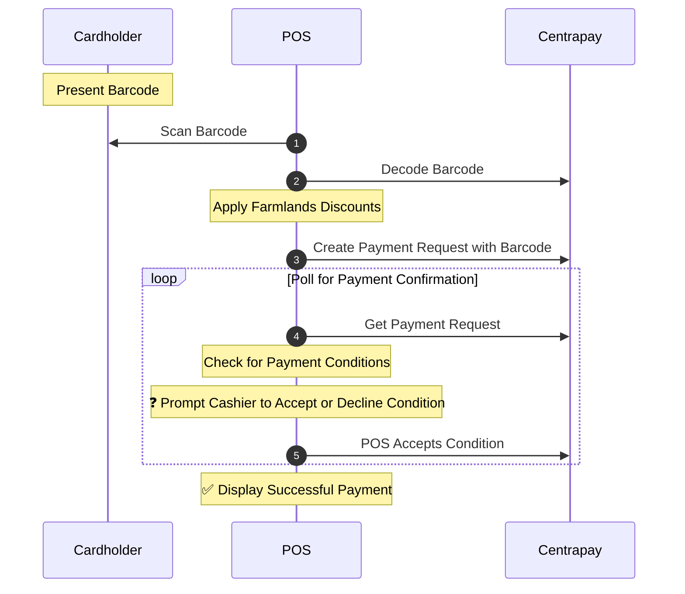
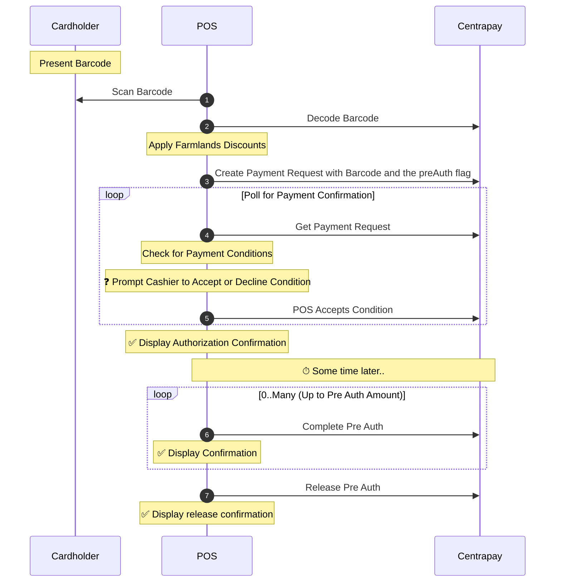

Centrapay and Farmlands have entered into a partnership that will allow Farmlands Card Partners to accept the Farmlands Card for payment at the point of sale. The benefits include real-time balance checks, the elimination of reconciliation EDI files, and it unlocks the ability to accept many more payment methods on the Centrapay platform.

Farmlands Card Partners need to be approved by Farmlands in order to enable the Farmlands Card as a payment option through the Centrapay integration. Please get in touch with your Farmlands Partnership Manager or the Contact Centre and request access.


## Benefits of using the Centrapay Integration

Integrating with Centrapay streamlines the process for authorising and invoicing Farmlands Card Payments. The integration provides:

1. Real-time validation that the card presented is a valid Farmlands card.
2. Real-time balance checks to verify that the cardholder has sufficient funds.
3. Automatic notification of invoices for Card Partners that submit invoices with Centrapay.
4. The ability to accept other assets as payment methods with Centrapay.

## How the Integration Works

A Farmlands Cardholder presents their Farmlands Card for payment. The cashier at the point of sale will either scan the Barcode or enter the 9-digit Farmlands Card number.

A Centrapay Payment Request is created with the Farmlands Card number included and Centrapay will automatically confirm the transaction if the card has enough balance to cover the payment.

<!-- TODO: Add image of example Farmlands card -->
<!-- https://www.notion.so/centrapay/Farmlands-POS-Integration-Guide-a54f8fefc03748efafe657d41953a2fd#de0da12b6c2a4a649284a8c8fe20934f -->

## Farmlands Payment Flows

Farmlands Card Partners can integrate with Centrapay via the following payment flows depending on their requirements.

1. Simple Flow
2. Pre Auth Flow
3. Patron Not Present Flow

If you need a deeper dive into how to request payment using Centrapay’s APIs, please see our additional documentation on:

<!-- TODO: Link to Requesting Payment page when it is created -->
- [Requesting Payment](https://www.notion.so/Requesting-Payment-ad4c917a690a4bc3a4de5fc04a7396c2)
<!-- TODO: Link to Merchant Payment Conditions page when it is created -->
- Accepting [Merchant Payment Conditions](https://www.notion.so/Merchant-Payment-Conditions-a3e1c7f987b0400da28ef334a25229cc)
<!-- TODO: Link to Pre Auth page when it is created -->
- Accepting [Pre Auth](https://www.notion.so/Pre-Auth-5d923a9225a949329d3cccf3d7e3a879) payments
<!-- TODO: Link to Patron Not Present page when it is created -->
- Accepting payments when  [Patron Not Present](https://www.notion.so/Patron-Not-Present-7da502cf99de4bd1af82a3bf8ed05e90)

### Simple Flow

The Simple Flow should be used when:

- You can fulfil the purchase immediately; or
- You already have an invoice number for the purchase.

Using this payment flow removes the need for a PDF invoice or EDI file to be sent to Farmlands.



1. The Cardholder presents their Farmlands card for the POS to scan.
2. (Optional) The POS decodes the Scanned Barcode to confirm that it is valid and applies Farmlands discounts.
- [[API Reference](https://docs.centrapay.com/api/scanned-codes#decode-scanned-code)]

    ```bash [Request]
    curl -X POST https://service.centrapay.com/api/decode \
      -H "Authorization: $jwt" \
      -H "Content-Type: application/json" \
      -d '{
        "code": "123456789",
        "scannedBy": "merchant",
        "merchantConfigId": "5ee168e8597be5002af7b454"
      }'
    ```

    ```bash [Response]
    {
      "code": "123456789",
      "scannedBy": "merchant",
      "merchantConfigId": "5ee168e8597be5002af7b454",
      "provider": "farmlands",
      "displayName": "Farmlands Card"
    }
    ```

3. The POS creates a Centrapay Payment Request with the barcode.

    Farmlands POS Integrators must support Merchant Payment Conditions by creating Payment Requests with the `conditionsEnabled` flag.
    - [[API Reference](https://docs.centrapay.com/api/payment-requests#create-a-payment-request)]

    ```bash [Request]
    curl -X POST https://service.centrapay.com/api/payment-requests \
      -H "X-Api-Key: $api_key" \
      -H "Content-Type: application/json" \
      -d '{
        "barcode": "123456789",
        "configId": "5ee168e8597be5002af7b454",
        "value": {
          "amount": "10000",
          "currency": "NZD"
        },
        "purchaseOrderRef": "oF6kj1QlH5gK0y9rjRHFh2",
        "invoiceRef": "sy8CRmo3sp3ArOpnfmb423",
        "lineItems": [
          {
            "name": "Hard Hat",
            "sku": "GH1234",
            "qty": "1",
            "price": "4000",
            "tax": "15",
            "discount": "400"
          },
          {
            "name": "Tool Belt",
            "sku": "GH1234",
            "qty": "1",
            "price": "6000",
            "tax": "15",
            "discount": "600"
          }
        ],
        "conditionsEnabled": "true"
      }'
    ```

    ```json [Response]
    {
      "id": "MhocUmpxxmgdHjr7DgKoKw",
      "shortCode": "CP-C7F-ZS5",
      "url": "https://app.centrapay.com/pay/MhocUmpxxmgdHjr7DgKoKw",
      "patronCodeId": "V17FByEP9gm1shSG6a1Zzx",
      "barcode": "123456789",
      "merchantId": "26d3Cp3rJmbMHnuNJmks2N",
      "merchantName": "Farmlands Card Partner",
      "configId": "5ee168e8597be5002af7b454",
      "purchaseOrderRef": "oF6kj1QlH5gK0y9rjRHFh2",
      "invoiceRef": "sy8CRmo3sp3ArOpnfmb423",
      "value": {
        "currency": "NZD",
        "amount": "10000"
      },
      "paymentOptions": [
        {
          "amount": "10000",
          "assetType": "farmlands.nzd.main"
        }
      ],
      "lineItems": [
        {
          "name": "Hard Hat",
          "sku": "GH1234",
          "qty": "1",
          "price": "4000",
          "tax": "15",
          "discount": "400"
        },
        {
          "name": "Tool Belt",
          "sku": "GH1234",
          "qty": "1",
          "price": "6000",
          "tax": "15",
          "discount": "600"
        }
      ],
      "merchantConditions": [
        {
          "id": "1",
          "name": "photo-id-check",
          "message": "Please check ID"
          "status": "awaiting-merchant",
        }
      ],
      "status": "new",
      "createdAt": "2021-06-08T04:04:27.426Z",
      "updatedAt": "2021-06-08T04:04:27.426Z",
      "expiresAt": "2021-06-08T04:06:27.426Z",
      "expirySeconds": 120,
      "conditionsEnabled": "true"
    }
    ```

4. The POS polls the Payment Request for status changes.
- [[API Reference](https://docs.centrapay.com/api/payment-requests#get-a-payment-request)]

    ```bash [Request]
    curl https://service.centrapay.com/api/payment-requests/MhocUmpxxmgdHjr7DgKoKw \
      -H "Authorization: $jwt"
    ```

    ```json [Response]
    {
      "id": "MhocUmpxxmgdHjr7DgKoKw",
      "shortCode": "CP-C7F-ZS5",
      "url": "https://app.centrapay.com/pay/MhocUmpxxmgdHjr7DgKoKw",
      "patronCodeId": "V17FByEP9gm1shSG6a1Zzx",
      "barcode": "123456789",
      "merchantId": "26d3Cp3rJmbMHnuNJmks2N",
      "merchantName": "Farmlands Card Partner",
      "configId": "5efbe2fb96c08357bb2b9242",
      "purchaseOrderRef": "oF6kj1QlH5gK0y9rjRHFh2",
      "invoiceRef": "sy8CRmo3sp3ArOpnfmb423",
      "value": {
        "currency": "NZD",
        "amount": "10000"
      },
      "paymentOptions": [
        {
          "amount": "10000",
          "assetType": "farmlands.nzd.main"
        }
      ],
      "lineItems": [
        {
          "name": "Hard Hat",
          "sku": "GH1234",
          "qty": "1",
          "price": "4000",
          "tax": "15",
          "discount": "400"
        },
        {
          "name": "Tool Belt",
          "sku": "GH1234",
          "qty": "1",
          "price": "6000",
          "tax": "15",
          "discount": "600"
        }
      ],
      "merchantConditions": [
        {
          "id": "1",
          "name": "photo-id-check",
          "message": "Please check ID"
          "status": "awaiting-merchant",
        }
      ],
      "status": "new",
      "createdAt": "2021-06-08T04:04:27.426Z",
      "updatedAt": "2021-06-08T04:04:27.426Z",
      "expiresAt": "2021-06-08T04:06:27.426Z",
      "expirySeconds": 120,
      "conditionsEnabled": "true",
      "patronNotPresent": "true"
    }
    ```

5. The POS must prompt the cashier to accept or decline any pending Merchant Payment Conditions  (e.g. an identification check for high-risk transactions).
    - [[API Reference](https://docs.centrapay.com/api/payment-requests#accept-payment-condition-for-a-payment-request-experimental)] to accept a pending Merchant Payment Condition

    ```bash [Request]
    curl -X POST https://service.centrapay.com/api/payment-requests/MhocUmpxxmgdHjr7DgKoKw/conditions/1/accept \
      -H "X-Api-Key: $api_key"
    ```

    ```json [Response]
    {
      "type": "accept-condition",
      "value": {
        "currency": "NZD",
        "amount": 100
      },
      "paymentRequestId": "MhocUmpxxmgdHjr7DgKoKw",
      "conditionId": "1",
      "createdAt": "2022-05-12T01:17:00.000Z",
      "createdBy": "crn::user:0af834c8-1110-11ec-9072-3e22fb52e878",
      "paymentRequestCreatedBy": "crn::user:0af834c8-1110-11ec-9072-3e22fb52e878",
      "activityNumber": "2",
      "merchantAccountId": "C4QnjXvj8At6SMsEN4LRi9",
      "merchantId": "26d3Cp3rJmbMHnuNJmks2N",
      "merchantConfigId": "5ee168e8597be5002af7b454",
      "merchantName": "Farmlands Card Partner"
    }
    ```

    - [[API Reference](https://docs.centrapay.com/api/payment-requests#decline-payment-condition-for-a-payment-request-experimental)] to decline a pending Merchant Payment Condition

    ```bash [Request]
    curl -X POST https://service.centrapay.com/api/payment-requests/MhocUmpxxmgdHjr7DgKoKw/conditions/1/decline \
      -H "X-Api-Key: $api_key"
    ```

    ```json [Response]
    {
      "type": "decline-condition",
      "value": {
        "currency": "NZD",
        "amount": 100
      },
      "paymentRequestId": "MhocUmpxxmgdHjr7DgKoKw",
      "conditionId": "1",
      "createdAt": "2022-05-12T01:17:00.000Z",
      "createdBy": "crn::user:0af834c8-1110-11ec-9072-3e22fb52e878",
      "paymentRequestCreatedBy": "crn::user:0af834c8-1110-11ec-9072-3e22fb52e878",
      "activityNumber": "2",
      "merchantAccountId": "C4QnjXvj8At6SMsEN4LRi9",
      "merchantId": "26d3Cp3rJmbMHnuNJmks2N",
      "merchantConfigId": "5ee168e8597be5002af7b454",
      "merchantName": "Farmlands Card Partner"
    }
    ```

After each Payment Condition is accepted or declined, the POS must continue to poll the Payment Request until the Payment Request status is paid. Here, the POS can stop polling and display confirmation of the successful payment.

### Pre Auth Flow
<!-- TODO: Link to Pre Auth page when it is created -->
The [Pre Auth](https://www.notion.so/Pre-Auth-5d923a9225a949329d3cccf3d7e3a879) flow involves creating an authorization that ensures funds are available and places a hold on them.

An authorization can optionally be followed up with one or more confirmations as the line items in the authorization are fulfilled. Using Pre Auth confirmations removes the need to send a PDF invoice or EDI file to Farmlands for settlement.

This flow should be used when:

- You do not have an invoice number for the purchase at the point of authorisation or;
- You cannot fulfil the purchase immediately - this might happen if your stock is not on hand or you have a separate fulfilment process.



1. The Cardholder presents their Farmlands card for the POS to scan.
2. (Optional) The POS decodes the Scanned Barcode to confirm that it is valid and applies Farmlands discounts.
    - [[API Reference](https://docs.centrapay.com/api/scanned-codes#decode-scanned-code)]

    ```bash [Request]
    curl -X POST https://service.centrapay.com/api/decode \
      -H "Authorization: $jwt" \
      -H "Content-Type: application/json" \
      -d '{
        "code": "123456789",
        "scannedBy": "merchant",
        "merchantConfigId": "5ee168e8597be5002af7b454"
      }'
    ```

    ```bash [Response]
    {
      "code": "123456789",
      "scannedBy": "merchant",
      "merchantConfigId": "5ee168e8597be5002af7b454",
      "provider": "farmlands",
      "displayName": "Farmlands Card"
    }
    ```

3. The POS authorises a Pre Auth payment by creating a Centrapay Payment Request with the barcode on the Farmlands Card and the `preauth` flag.

    Farmlands POS Integrators must support Merchant Payment Conditions by creating Payment Requests with the `conditionsEnabled` flag.

    - [[API Reference](https://docs.centrapay.com/api/payment-requests#create-a-payment-request)]

    ```bash [Request ]
    curl -X POST https://service.centrapay.com/api/payment-requests \
      -H "X-Api-Key: $api_key" \
      -H "Content-Type: application/json" \
      -d '{
        "barcode": "123456789",
        "configId": "5ee168e8597be5002af7b454",
        "value": {
          "amount": "10000",
          "currency": "NZD"
        },
        "lineItems": [
          {
            "name": "Hard Hat",
            "sku": "GH1234",
            "qty": "1",
            "price": "4000",
            "tax": "15",
            "discount": "400"
          },
          {
            "name": "Tool Belt",
            "sku": "GH1234",
            "qty": "1",
            "price": "6000",
            "tax": "15",
            "discount": "600"
          }
        ],
        "conditionsEnabled": "true",
        "preAuth": true
      }'
    ```

    ```json [Response]
    {
      "id": "MhocUmpxxmgdHjr7DgKoKw",
      "shortCode": "CP-C7F-ZS5",
      "url": "https://app.centrapay.com/pay/MhocUmpxxmgdHjr7DgKoKw",
      "patronCodeId": "V17FByEP9gm1shSG6a1Zzx",
      "barcode": "9990001234567895",
      "merchantId": "26d3Cp3rJmbMHnuNJmks2N",
      "merchantName": "Farmlands Card Partner",
      "configId": "5efbe2fb96c08357bb2b9242",
      "purchaseOrderRef": "oF6kj1QlH5gK0y9rjRHFh2",
      "invoiceRef": "sy8CRmo3sp3ArOpnfmb423",
      "value": {
        "currency": "NZD",
        "amount": "10000"
      },
      "paymentOptions": [
        {
          "amount": "10000",
          "assetType": "farmlands.nzd.main"
        }
      ],
      "lineItems": [
        {
          "name": "Hard Hat",
          "sku": "GH1234",
          "qty": "1",
          "price": "4000",
          "tax": "15",
          "discount": "400"
        },
        {
          "name": "Tool Belt",
          "sku": "GH1234",
          "qty": "1",
          "price": "6000",
          "tax": "15",
          "discount": "600"
        }
      ],
      "merchantConditions": [
        {
          "id": "1",
          "name": "photo-id-check",
          "message": "Please check ID"
          "status": "awaiting-merchant",
        }
      ],
      "status": "new",
      "createdAt": "2021-06-08T04:04:27.426Z",
      "updatedAt": "2021-06-08T04:04:27.426Z",
      "expiresAt": "2021-06-08T04:06:27.426Z",
      "expirySeconds": 120,
      "conditionsEnabled": "true",
      "patronNotPresent": "true"
    }
    ```

4. The POS polls the Payment Request for status changes.
    - [[API Reference](https://docs.centrapay.com/api/payment-requests#get-a-payment-request)]

    ```bash [Request]
    curl https://service.centrapay.com/api/payment-requests/MhocUmpxxmgdHjr7DgKoKw \
      -H "Authorization: $jwt"
    ```

    ```json [Response]
    {
      "id": "MhocUmpxxmgdHjr7DgKoKw",
      "shortCode": "CP-C7F-ZS5",
      "url": "https://app.centrapay.com/pay/MhocUmpxxmgdHjr7DgKoKw",
      "patronCodeId": "V17FByEP9gm1shSG6a1Zzx",
      "barcode": "123456789",
      "merchantId": "26d3Cp3rJmbMHnuNJmks2N",
      "merchantName": "Farmlands Card Partner",
      "configId": "5efbe2fb96c08357bb2b9242",
      "purchaseOrderRef": "oF6kj1QlH5gK0y9rjRHFh2",
      "invoiceRef": "sy8CRmo3sp3ArOpnfmb423",
      "value": {
        "currency": "NZD",
        "amount": "10000"
      },
      "paymentOptions": [
        {
          "amount": "10000",
          "assetType": "farmlands.nzd.main"
        }
      ],
      "lineItems": [
        {
          "name": "Hard Hat",
          "sku": "GH1234",
          "qty": "1",
          "price": "4000",
          "tax": "15",
          "discount": "400"
        },
        {
          "name": "Tool Belt",
          "sku": "GH1234",
          "qty": "1",
          "price": "6000",
          "tax": "15",
          "discount": "600"
        }
      ],
      "merchantConditions": [
        {
          "id": "1",
          "name": "photo-id-check",
          "message": "Please check ID"
          "status": "awaiting-merchant",
        }
      ],
      "status": "new",
      "createdAt": "2021-06-08T04:04:27.426Z",
      "updatedAt": "2021-06-08T04:04:27.426Z",
      "expiresAt": "2021-06-08T04:06:27.426Z",
      "expirySeconds": 120,
      "conditionsEnabled": "true",
      "patronNotPresent": "false"
    }
    ```

5. The POS must prompt the cashier to accept or decline any pending Merchant Payment Conditions  (e.g. an identification check for high-risk transactions).
    - [[API Reference](https://docs.centrapay.com/api/payment-requests#accept-payment-condition-for-a-payment-request-experimental)] to accept a pending Merchant Payment Condition

    ```bash [Request]
    curl -X POST https://service.centrapay.com/api/payment-requests/MhocUmpxxmgdHjr7DgKoKw/conditions/1/accept \
      -H "X-Api-Key: $api_key"
    ```

    ```json [Response]
    {
      "type": "accept-condition",
      "value": {
        "currency": "NZD",
        "amount": 100
      },
      "paymentRequestId": "MhocUmpxxmgdHjr7DgKoKw",
      "conditionId": "1",
      "createdAt": "2022-05-12T01:17:00.000Z",
      "createdBy": "crn::user:0af834c8-1110-11ec-9072-3e22fb52e878",
      "paymentRequestCreatedBy": "crn::user:0af834c8-1110-11ec-9072-3e22fb52e878",
      "activityNumber": "2",
      "merchantAccountId": "C4QnjXvj8At6SMsEN4LRi9",
      "merchantId": "26d3Cp3rJmbMHnuNJmks2N",
      "merchantConfigId": "5ee168e8597be5002af7b454",
      "merchantName": "Farmlands Card Partner"
    }
    ```

    - [[API Reference](https://docs.centrapay.com/api/payment-requests#decline-payment-condition-for-a-payment-request-experimental)] to decline a pending Merchant Payment Condition

    ```bash [Request]
    curl -X POST https://service.centrapay.com/api/payment-requests/MhocUmpxxmgdHjr7DgKoKw/conditions/1/decline \
      -H "X-Api-Key: $api_key"
    ```

    ```json [Response]
    {
      "type": "decline-condition",
      "value": {
        "currency": "NZD",
        "amount": 100
      },
      "paymentRequestId": "MhocUmpxxmgdHjr7DgKoKw",
      "conditionId": "1",
      "createdAt": "2022-05-12T01:17:00.000Z",
      "createdBy": "crn::user:0af834c8-1110-11ec-9072-3e22fb52e878",
      "paymentRequestCreatedBy": "crn::user:0af834c8-1110-11ec-9072-3e22fb52e878",
      "activityNumber": "2",
      "merchantAccountId": "C4QnjXvj8At6SMsEN4LRi9",
      "merchantId": "26d3Cp3rJmbMHnuNJmks2N",
      "merchantConfigId": "5ee168e8597be5002af7b454",
      "merchantName": "Farmlands Card Partner"
    }
    ```

    After each condition is accepted or declined, the POS must continue to poll the Payment Request until the Payment Request status is `paid`. Here, the POS can stop polling and display confirmation of the successful authorization.

6. When the purchase is ready to be fulfilled, the POS makes a confirmation against the Pre Auth Payment Request. There can be multiple confirmations against a Pre Auth payment but the total sum confirmed cannot exceed the authorised Payment Request amount.

    Note that making confirmations against a Pre Auth Payment Request is optional however doing so will remove the need to send an invoice PDF or EDI file to Farmlands for settlement.

    - [[API Reference](https://docs.centrapay.com/api/payment-requests#make-a-confirmation-against-a-pre-auth-payment-request-experimental)]

    ```bash [Request ]
    curl -X POST https://service.centrapay.com/api/payment-requests/MhocUmpxxmgdHjr7DgKoKw/confirm \
      -H "X-Api-Key: $api_key" \
      -H "Content-Type: application/json" \
      -d '{
        "value": {
          "amount": "4000",
          "currency": "NZD"
        },
        "idempotencyKey": "e8df06e2-13a5-48b4-b670-3fd6d815fe0a",
        "invoiceRef": "sy8CRmo3sp3ArOpnfmb423",
        "lineItems": [
          {
            "name": "Hard Hat",
            "sku": "GH1234",
            "qty": "1",
            "price": "4000",
            "tax": "15",
            "discount": "400"
          }
        ],
      }'
    ```

    ```json [Response]
    {
      "paymentRequestId": "MhocUmpxxmgdHjr7DgKoKw",
      "shortCode": "CP-C7F-ZS5-015",
      "value": {
        "amount": "4000",
        "currency": "NZD"
      },
      "preAuth": true,
      "type": "confirmation",
      "idempotencyKey": "e8df06e2-13a5-48b4-b670-3fd6d815fe0a",
      "createdAt": "2021-06-08T04:04:27.426Z",
      "updatedAt": "2021-06-08T04:04:27.426Z",
      "lineItems": [
        {
          "name": "Hard Hat",
          "sku": "GH1234",
          "qty": "1",
          "price": "4000",
          "tax": "15",
          "discount": "400"
        }
      ],
      "invoiceRef": "sy8CRmo3sp3ArOpnfmb423",
      "createdByAccountId": "Jaim1Cu1Q55uooxSens6yk",
      "createdByAccountName": "Farmlands Card Partner"
    }
    ```

7. The POS releases any remaining funds against the Payment Request back to the cardholder. The Payment Request `preAuth` status is now `released` and a confirmation can be displayed.

    Pre Auth Payment Requests automatically expire after 3 months. Any unreleased funds are subsequently released to the Cardholder.

    - [[API Reference](https://docs.centrapay.com/api/payment-requests#release-funds-held-for-a-pre-auth-payment-request-experimental)]

    ```bash [Request]
    curl -X POST https://service.centrapay.com/api/payment-requests/MhocUmpxxmgdHjr7DgKoKw/release \
      -H "X-Api-Key: $api_key"
    ```

    ```json [Response]
    {
      "type": "release",
      "value": {
        "currency": "NZD",
        "amount": "6000"
      },
      "assetType": "farmlands.nzd.main",
      "preAuth": true,
      "paymentRequestId": "MhocUmpxxmgdHjr7DgKoKw",
      "shortCode": "CP-C7F-ZS5",
      "merchantName": "Farmlands Card Partner",
      "merchantId": "26d3Cp3rJmbMHnuNJmks2N",
      "merchantAccountId": "C4QnjXvj8At6SMsEN4LRi9",
      "merchantConfigId": "5ee168e8597be5002af7b454",
      "createdAt": "2021-06-12T01:17:00.000Z",
      "createdBy": "crn::user:0af834c8-1110-11ec-9072-3e22fb52e878",
      "paymentRequestCreatedBy": "crn::user:0af834c8-1110-11ec-9072-3e22fb52e878",
      "activityNumber": "3"
    }
    ```


### Patron Not Present Flow
<!-- TODO: Link to Patron Not Present page when it is created -->
The [Patron Not Present](https://www.notion.so/Patron-Not-Present-7da502cf99de4bd1af82a3bf8ed05e90) flow should be used when the Cardholder is not physically present when a Pre Auth payment is authorised. For example, it can be used to support phone-based orders or where the Farmlands barcode is already known.

Please refer to the Farmlands Card Partner Acceptance Terms and Conditions to understand the risks involved with these transactions.

You can extend the Pre Auth flow to support this by [creating the Centrapay Payment Request](https://docs.centrapay.com/api/payment-requests#create-a-payment-request) with the `patronNotPresent` flag set to true.

- [Request](https://docs.centrapay.com/api/payment-requests#create-a-payment-request)

## Integration Certification Requirements
For Centrapay to allow integrations to have production assets turned on, we require partners to complete a Certification Process. Farmlands POS Integrators must meet these requirements:

- The POS scanner SHOULD be capable of scanning the barcode on the back of a Farmlands card.
- The POS MUST support manual barcode entry.
<!-- TODO: Link to Merchant Payment Conditions page when it is created -->
- [Merchant Payment Conditions](https://www.notion.so/Merchant-Payment-Conditions-a3e1c7f987b0400da28ef334a25229cc) MUST be enabled when creating a Payment Request. This is to enforce requiring an ID check when the payment exceeds a limit set by Farmlands.
- An Invoice Number MUST be supplied when making confirmations and refunds against a Payment Request.
<!-- TODO: Link to Patron Not Present page when it is created -->
- [Line Items](https://www.notion.so/Line-Items-c40af3397c8442c9aeb35f883d7bacd3)  MUST be supplied when making confirmations and refunds against a Payment Request. Line Items MUST include the discount provided to the Card Holder.
<!-- TODO: Link to Pre Auth page when it is created -->
- [Pre Auth](https://www.notion.so/Pre-Auth-5d923a9225a949329d3cccf3d7e3a879) MUST be implemented when invoice numbers are not available at the time of purchase. Pre Auth completion MAY be performed through existing reconciliation channels (eg PDF, EDI messaging) if confirmations are not being created.
- Centrapay short code MUST be provided when reconciling Centrapay payments with Farmlands via non-Centrapay channels.
<!-- TODO: Link to Patron Not Present page when it is created -->
- The [Patron Not Present](https://www.notion.so/Patron-Not-Present-7da502cf99de4bd1af82a3bf8ed05e90) flag SHOULD be supported. This is required if the POS is used to accept Farmlands transactions over the phone.
<!-- TODO: Link to Merchant Payment Errors page when it is created -->
- [Merchant Payment Errors](https://www.notion.so/Merchant-Payment-Errors-2078164fbdbe425caa4f2fd878ad3969) MUST be handled correctly.
<!-- TODO: Link to Initiating Refunds page when it is created -->
- [Initiating Refunds](https://www.notion.so/Initiating-Refunds-ae3daeeb04c24b8b8e22680cc475afd7) MUST be performed using the `externalRef` or `shortCode` Payment Request fields.
- The Payment Request `externalRef` and/or `shortCode` MUST be available to the Patron (eg, on paper print-out).
<!-- TODO: Link to Transaction Reporting page when it is created -->
- Paid asset types MUST be made available for merchant [Transaction Reporting](https://www.notion.so/Transaction-Reporting-3e80c48d8241400ba25d9d169fdaff59).

## Testing Your Integration
Merchant Integrators need to work with Farmlands and Centrapay to get set up to test payments and meet Centrapay’s Certification requirements.

1. Please contact Centrapay to set up a test organisation account and for support to create test payments.
2. Please contact Farmlands to organise end-to-end testing. This process is expected to take up to 6 weeks.

## Next Steps
1. Existing Farmlands Card Partners should reach out to their Card Portfolio Manager to see if the Centrapay Integration is appropriate for them.
2. Reach out to `integrations@centrapay.com` to get your API key and a copy of Centrapay’s Certification Process.
