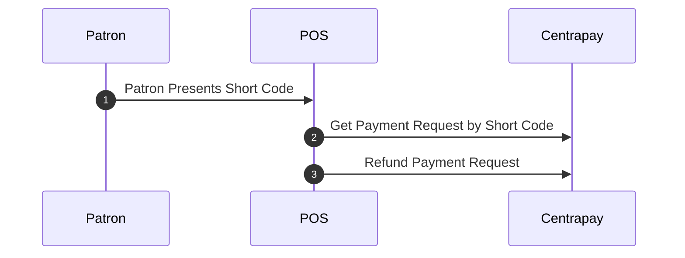
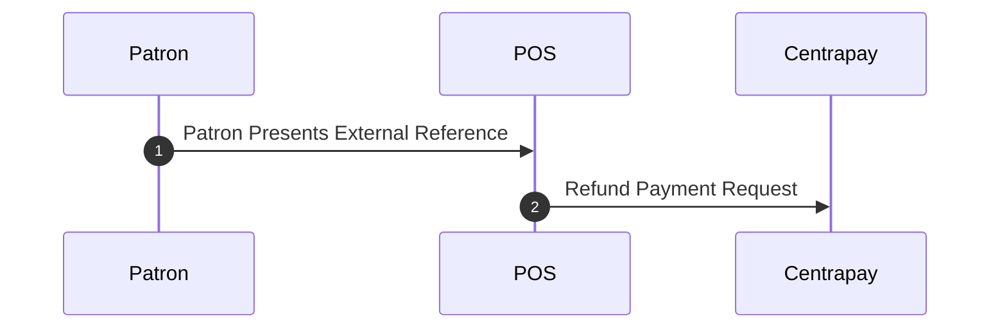

Refunds are initiated by calling the [Refund Payment Request](https://docs.centrapay.com/api/payment-requests#refund-a-payment-request-experimental) endpoint.

Refunds can be partial or full. Partial refunds can be performed multiple times but the total refunded amount cannot exceed the paid amount.

## Refund Idempotency

Refund requests must provide an `externalRef` that is unique for all refunds made against the [Payment Request](https://docs.centrapay.com/api/payment-requests#payment-request).

This field provides idempotency for the refund operation and ensures that a refund can be retried safely and only one refund will be actioned. Subsequent refund requests with the same `amount` and `externalRef` will respond with `HTTP 200 OK`.

## Obtaining a Payment Request Id

Refunds are initiated using the identifier for the [Payment Request](https://docs.centrapay.com/api/payment-requests#payment-request). However, a patron is NOT expected to have this information available.

Merchants can obtain a Payment Request identifier by looking the Payment Request up by `shortCode` or by using some other transaction reference available to the patron.

Digital wallets that support transacting with Centrapay will always make the Payment Request `shortCode` and `externalRef` attributes discoverable in the user’s transaction history so they can be used to negotiate refunds.

### By Short Code

Call the [Get Payment Request by Short Code](https://docs.centrapay.com/api/payment-requests#get-a-payment-request-by-short-code) endpoint using the Centrapay short code that the patron obtains from their paper receipt or digital wallet transaction history.

### By Transaction Reference

Lookup the transaction within the merchant system using the transaction reference that the patron obtains from their paper receipt or digital wallet transaction history.

The transaction reference is made available to users of digital wallets by attaching it as the `externalRef` attribute when [Requesting Payment](/guides/requesting-payment).

## Refund Error Handling

There are a number of reasons why refunds can fail. These are documented on the [Refund Payment Request](https://docs.centrapay.com/api/payment-requests#refund) endpoint and should be communicated to the user.

Refunds that encounter unknown errors should be retried as per [Merchant Integration Error Handling](/guides/merchant-integration-error-handling).

When retrying unknown errors is impossible, POS operators may need to select a different refund method.

## Multi-Asset Selection

[Payment Requests](https://docs.centrapay.com/api/payment-requests#payment-request) may be paid by multiple assets. When refunding a multi-asset Payment Request, the refunded asset is not controllable by the merchant.

The asset(s) to refund will be selected automatically based on the asset type refund priority. In general, the most flexible asset types will have the highest priority.  For example, assets that are acceptable at the broadest number of merchants (ie, cash equivalent assets) will be refunded first and the most restrictive assets will be refunded last.
