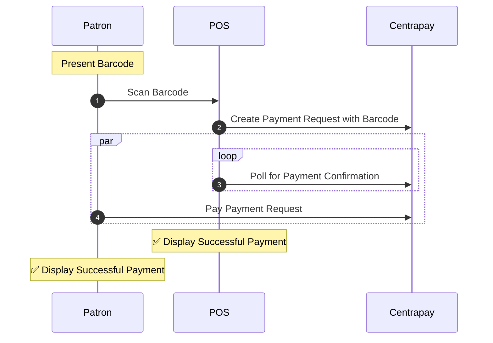
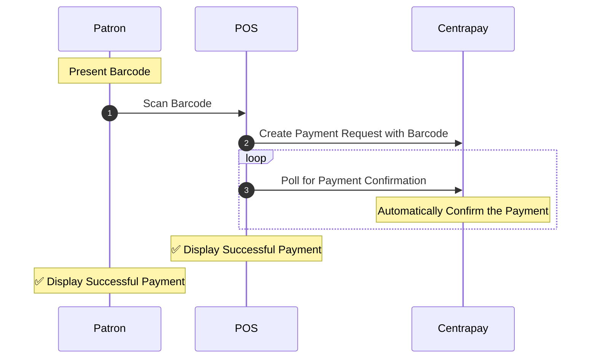
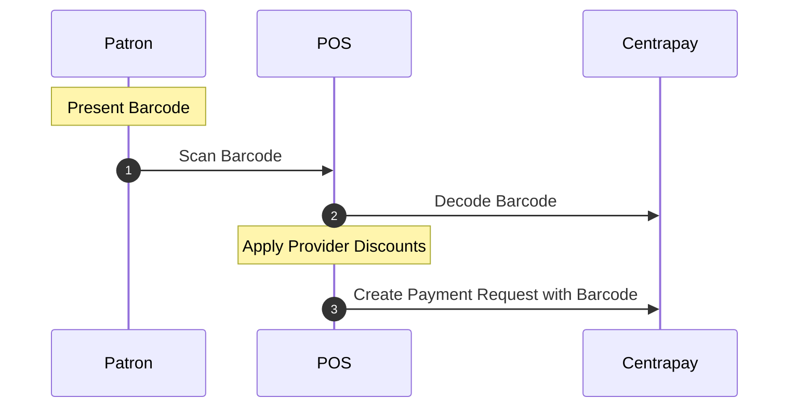

Connecting with Patrons using our Barcode Flow requires the Patron to present a Barcode and the merchant integration to scan it in order to [create a Payment Request](https://docs.centrapay.com/api/payment-requests#create-a-payment-request).

## Barcode Flow

The sequence diagram below indicates the expected flow of behavior between the Patron, the Point of Sale (POS) and Centrapay.



1. The Patron presents a Barcode for the POS to scan.
2. The POS [creates a Centrapay Payment Request](https://docs.centrapay.com/api/payment-requests#create-a-payment-request) with the Barcode.

    ```bash [Request]
    curl -X POST https://service.centrapay.com/api/payment-requests \
      -H "X-Api-Key: $api_key" \
      -H "Content-Type: application/json" \
      -d '{
        "barcode": "123456789",
        "configId": "5ee168e8597be5002af7b454",
        "value": {
          "amount": "10000",
          "currency": "NZD"
        }
      }'
    ```

    ```json [Response]
    {
      "barcode": "123456789",
      "configId": "5ee168e8597be5002af7b454",
      "createdAt": "2021-06-08T04:04:27.426Z",
      "expiresAt": "2021-06-08T04:06:27.426Z",
      "expirySeconds": 120,
      "id": "MhocUmpxxmgdHjr7DgKoKw",
      "merchantId": "26d3Cp3rJmbMHnuNJmks2N",
      "merchantName": "Centrapay Café",
      "patronCodeId": "V17FByEP9gm1shSG6a1Zzx",
      "paymentOptions": [
        {
          "amount": "10000",
          "assetType": "centrapay.nzd.main"
        }
      ],
      "purchaseOrderRef": "oF6kj1QlH5gK0y9rjRHFh2",
      "shortCode": "CP-C7F-ZS5",
      "status": "new",
      "updatedAt": "2021-06-08T04:04:27.426Z",
      "url": "https://app.centrapay.com/pay/MhocUmpxxmgdHjr7DgKoKw",
      "value": {
        "currency": "NZD",
        "amount": "10000"
      }
    }
    ```

3. The POS [polls the Payment Request for](https://docs.centrapay.com/api/payment-requests#get-a-payment-request) Payment Confirmation.

    ```bash [Request]
    curl https://service.centrapay.com/api/payment-requests/MhocUmpxxmgdHjr7DgKoKw \
      -H "Authorization: $jwt"
    ```

    ```json [Response]
    {
      "barcode": "123456789",
      "configId": "5ee168e8597be5002af7b454",
      "createdAt": "2021-06-08T04:04:27.426Z",
      "expiresAt": "2021-06-08T04:06:27.426Z",
      "expirySeconds": 120,
      "id": "MhocUmpxxmgdHjr7DgKoKw",
      "merchantId": "26d3Cp3rJmbMHnuNJmks2N",
      "merchantName": "Centrapay Café",
      "patronCodeId": "V17FByEP9gm1shSG6a1Zzx",
      "paymentOptions": [
        {
          "amount": "10000",
          "assetType": "centrapay.nzd.main"
        }
      ],
      "shortCode": "CP-C7F-ZS5",
      "status": "new",
      "updatedAt": "2021-06-08T04:04:27.426Z",
      "url": "https://app.centrapay.com/pay/MhocUmpxxmgdHjr7DgKoKw",
      "value": {
        "currency": "NZD",
        "amount": "10000"
      }
    }
    ```

4. While the POS continues to poll, the Patron [pays the Payment Request](https://docs.centrapay.com/api/payment-requests#pay-a-payment-request-experimental) via their Centrapay integrated app.

    ```bash [Request]
    curl -X POST https://service.centrapay.com/api/payment-requests/MhocUmpxxmgdHjr7DgKoKw/pay \
      -H "Authorization: $jwt" \
      -H "Content-Type: application/json" \
      -d '{
        "assetType": "centrapay.nzd.main",
        "assetId": "WRhAxxWpTKb5U7pXyxQjjY"
      }'
    ```

    ```json [Response]
    {
      "activityNumber": "2",
      "assetType": "centrapay.nzd.main",
      "createdAt": "2021-06-08T04:04:27.426Z",
      "createdBy": "crn::user:0af834c8-1110-11ec-9072-3e22fb52e878",
      "merchantAccountId": "C4QnjXvj8At6SMsEN4LRi9",
      "merchantConfigId": "5ee168e8597be5002af7b454",
      "merchantId": "26d3Cp3rJmbMHnuNJmks2N",
      "merchantName": "Centrapay Café",
      "paymentRequestCreatedBy": "crn::user:0af834c8-1110-11ec-9072-3e22fb52e878",
      "paymentRequestId": "MhocUmpxxmgdHjr7DgKoKw",
      "shortCode": "CP-C7F-ZS5",
      "type": "payment",
      "value": {
        "currency": "NZD",
        "amount": "10000"
      }
    }
    ```


    When the Payment Request status is `paid`, the POS stops polling and displays confirmation of the successful payment.

    ```bash [Request]
    curl https://service.centrapay.com/api/payment-requests/MhocUmpxxmgdHjr7DgKoKw \
      -H "Authorization: $jwt"
    ```

    ```json [Response]
    {
      "barcode": "123456789",
      "configId": "5ee168e8597be5002af7b454",
      "createdAt": "2021-06-08T04:04:27.426Z",
      "expiresAt": "2021-06-08T04:06:27.426Z",
      "expirySeconds": 120,
      "id": "MhocUmpxxmgdHjr7DgKoKw",
      "merchantId": "26d3Cp3rJmbMHnuNJmks2N",
      "merchantName": "Centrapay Café",
      "patronCodeId": "V17FByEP9gm1shSG6a1Zzx",
      "paymentOptions": [
        {
          "amount": "10000",
          "assetType": "centrapay.nzd.main"
        }
      ],
      "purchaseOrderRef": "oF6kj1QlH5gK0y9rjRHFh2",
      "shortCode": "CP-C7F-ZS5",
      "status": "paid",
      "updatedAt": "2021-06-08T04:04:27.426Z",
      "url": "https://app.centrapay.com/pay/MhocUmpxxmgdHjr7DgKoKw",
      "value": {
        "currency": "NZD",
        "amount": "10000"
      }
    }
    ```

## Quick Pay Flow

Quick Pay is used to immediately confirm the payment without requiring Patron approval.

The Patron’s barcode must be linked to an asset type that allows Quick Pay in order to use this flow. See [Asset Types](https://docs.centrapay.com/api/asset-types) for the list of asset types that support Quick Pay.



1. The Patron presents a Barcode for the POS to scan.
2. The POS [creates a Centrapay Payment Request](https://docs.centrapay.com/api/payment-requests#create-a-payment-request) with the Barcode.

    ```bash [Request]
    curl -X POST https://service.centrapay.com/api/payment-requests \
      -H "X-Api-Key: $api_key" \
      -H "Content-Type: application/json" \
      -d '{
        "barcode": "123456789",
        "configId": "5ee168e8597be5002af7b454",
        "value": {
          "amount": "10000",
          "currency": "NZD"
        }
      }'
    ```

    ```json [Response]
    {
      "barcode": "123456789",
      "configId": "5ee168e8597be5002af7b454",
      "createdAt": "2021-06-08T04:04:27.426Z",
      "expiresAt": "2021-06-08T04:06:27.426Z",
      "expirySeconds": 120,
      "id": "MhocUmpxxmgdHjr7DgKoKw",
      "merchantId": "26d3Cp3rJmbMHnuNJmks2N",
      "merchantName": "Centrapay Café",
      "patronCodeId": "V17FByEP9gm1shSG6a1Zzx",
      "paymentOptions": [
        {
          "amount": "10000",
          "assetType": "paypal.main"
        }
      ],
      "purchaseOrderRef": "oF6kj1QlH5gK0y9rjRHFh2",
      "shortCode": "CP-C7F-ZS5",
      "status": "new",
      "updatedAt": "2021-06-08T04:04:27.426Z",
      "url": "https://app.centrapay.com/pay/MhocUmpxxmgdHjr7DgKoKw",
      "value": {
        "currency": "NZD",
        "amount": "10000"
      }
    }
    ```

3. The POS [polls the Payment Request for](https://docs.centrapay.com/api/payment-requests#get-a-payment-request) payment confirmation.

    ```bash [Request]
    curl https://service.centrapay.com/api/payment-requests/MhocUmpxxmgdHjr7DgKoKw \
      -H "Authorization: $jwt"
    ```

    ```json [Response]
    {
      "barcode": "123456789",
      "configId": "5ee168e8597be5002af7b454",
      "createdAt": "2021-06-08T04:04:27.426Z",
      "expiresAt": "2021-06-08T04:06:27.426Z",
      "expirySeconds": 120,
      "id": "MhocUmpxxmgdHjr7DgKoKw",
      "merchantId": "26d3Cp3rJmbMHnuNJmks2N",
      "merchantName": "Centrapay Café",
      "patronCodeId": "V17FByEP9gm1shSG6a1Zzx",
      "paymentOptions": [
        {
          "amount": "10000",
          "assetType": "paypal.main"
        }
      ],
      "shortCode": "CP-C7F-ZS5",
      "status": "new",
      "updatedAt": "2021-06-08T04:04:27.426Z",
      "url": "https://app.centrapay.com/pay/MhocUmpxxmgdHjr7DgKoKw",
      "value": {
        "currency": "NZD",
        "amount": "10000"
      }
    }
    ```

4. When Centrapay receives the first attempt to poll the Payment Request, it will automatically trigger payment. After payment is successful and the Payment Request status is `paid`; the POS stops polling and displays confirmation of the successful payment.

    ```bash [Request]
    curl https://service.centrapay.com/api/payment-requests/MhocUmpxxmgdHjr7DgKoKw \
      -H "Authorization: $jwt"
    ```

    ```json [Response]
    {
      "barcode": "123456789",
      "configId": "5ee168e8597be5002af7b454",
      "createdAt": "2021-06-08T04:04:27.426Z",
      "expiresAt": "2021-06-08T04:06:27.426Z",
      "expirySeconds": 120,
      "id": "MhocUmpxxmgdHjr7DgKoKw",
      "merchantId": "26d3Cp3rJmbMHnuNJmks2N",
      "merchantName": "Centrapay Café",
      "patronCodeId": "V17FByEP9gm1shSG6a1Zzx",
      "paymentOptions": [
        {
          "amount": "10000",
          "assetType": "paypal.main"
        }
      ],
      "purchaseOrderRef": "oF6kj1QlH5gK0y9rjRHFh2",
      "shortCode": "CP-C7F-ZS5",
      "status": "paid",
      "updatedAt": "2021-06-08T04:04:27.426Z",
      "url": "https://app.centrapay.com/pay/MhocUmpxxmgdHjr7DgKoKw",
      "value": {
        "currency": "NZD",
        "amount": "10000"
      }
    }
    ```

## Checking Barcode Details

The POS can optionally [decode a scanned barcode](https://docs.centrapay.com/api/scanned-codes#decode-scanned-code) in order to get further details about a barcode before it creates a Payment Request. For example, the POS can use the barcode `provider` to apply any provider-specific discounts before creating the Payment Request.



1. The Patron presents a barcode for the POS to scan.
2. The POS [decodes the scanned barcode](https://docs.centrapay.com/api/scanned-codes#decode-scanned-code) and applies any provider-related discounts.

    ```bash [Request]
    curl -X POST https://service.centrapay.com/api/decode \
      -H "Authorization: $jwt" \
      -H "Content-Type: application/json" \
      -d '{
        "code": "123456789",
        "merchantConfigId": "5ee168e8597be5002af7b454",
        "scannedBy": "merchant"
      }'
    ```

    ```json [Response]
    {
      "code": "123456789",
      "displayName": "PayPal",
      "merchantConfigId": "5ee168e8597be5002af7b454",
      "provider": "paypal",
      "scannedBy": "merchant"
    }
    ```

3. The POS [creates a Payment Request](https://docs.centrapay.com/api/payment-requests#create-a-payment-request) with the barcode and continues with either the [Barcode Flow](#barcode-flow) or [Quick Pay Flow](#quick-pay-flow).

    ```bash [Request]
    curl -X POST https://service.centrapay.com/api/payment-requests \
      -H "X-Api-Key: $api_key" \
      -H "Content-Type: application/json" \
      -d '{
        "barcode": "123456789",
        "configId": "5ee168e8597be5002af7b454",
        "value": {
          "amount": "10000",
          "currency": "NZD"
        }
      }'
    ```

    ```json [Response]
    {
      "barcode": "123456789",
      "configId": "5ee168e8597be5002af7b454",
      "createdAt": "2021-06-08T04:04:27.426Z",
      "expiresAt": "2021-06-08T04:06:27.426Z",
      "expirySeconds": 120,
      "id": "MhocUmpxxmgdHjr7DgKoKw",
      "merchantId": "26d3Cp3rJmbMHnuNJmks2N",
      "merchantName": "Centrapay Café",
      "patronCodeId": "V17FByEP9gm1shSG6a1Zzx",
      "paymentOptions": [
        {
          "amount": "10000",
          "assetType": "paypal.main"
        }
      ],
      "purchaseOrderRef": "oF6kj1QlH5gK0y9rjRHFh2",
      "shortCode": "CP-C7F-ZS5",
      "status": "new",
      "updatedAt": "2021-06-08T04:04:27.426Z",
      "url": "https://app.centrapay.com/pay/MhocUmpxxmgdHjr7DgKoKw",
      "value": {
        "currency": "NZD",
        "amount": "10000"
      }
    }
    ```
