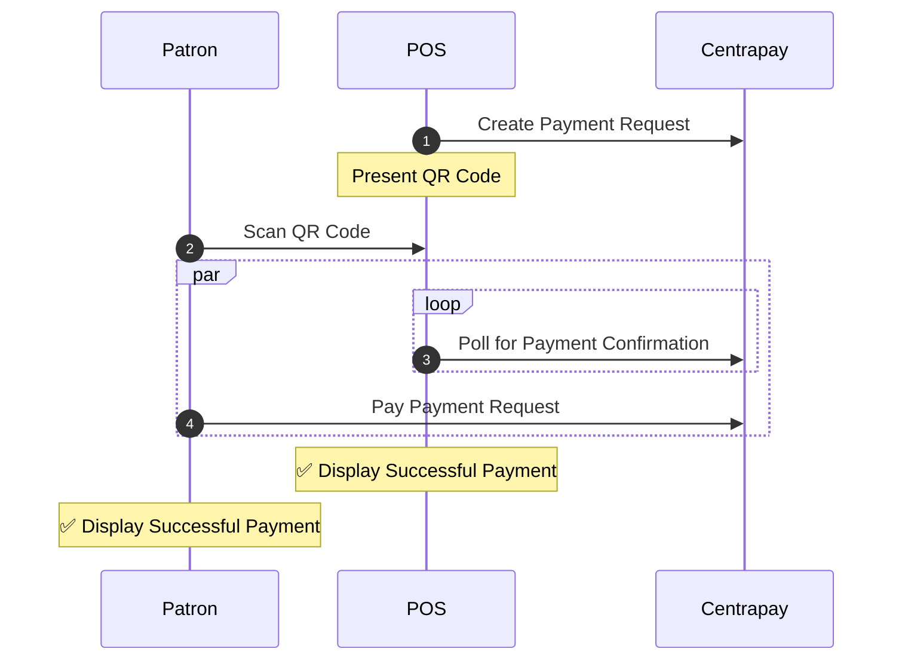

Connecting with Patrons using our QR Code Flow requires the merchant integration to create a [Payment Request](https://docs.centrapay.com/api/payment-requests) and present a QR Code for the Patron to scan.

The sequence diagram below indicates the expected flow of behavior between the Patron, the Point of Sale (POS) and Centrapay.



1. The POS [creates a Payment Request](https://docs.centrapay.com/api/payment-requests#create-a-payment-request) and presents a QR code to the Patron on a customer-facing display.

    > The QR code decodes to a URL of the form `https://service.centrapay.com/api/payment-requests/{paymentRequestId}/pay`

    ```bash [Request]
    curl -X POST https://service.centrapay.com/api/payment-requests \
      -H "X-Api-Key: $api_key" \
      -H "Content-Type: application/json" \
      -d '{
        "configId": "5ee168e8597be5002af7b454",
        "value": {
          "amount": "10000",
          "currency": "NZD"
        }
      }'
    ```

    ```json [Response]
    {
      "configId": "5ee168e8597be5002af7b454",
      "createdAt": "2021-06-08T04:04:27.426Z",
      "expiresAt": "2021-06-08T04:06:27.426Z",
      "expirySeconds": 120,
      "id": "MhocUmpxxmgdHjr7DgKoKw",
      "merchantId": "26d3Cp3rJmbMHnuNJmks2N",
      "merchantName": "Centrapay Café",
      "paymentOptions": [
        {
          "amount": "10000",
          "assetType": "centrapay.nzd.main"
        }
      ],
      "shortCode": "CP-C7F-ZS5",
      "status": "new",
      "updatedAt": "2021-06-08T04:04:27.426Z",
      "url": "https://app.centrapay.com/pay/MhocUmpxxmgdHjr7DgKoKw",
      "value": {
        "currency": "NZD",
        "amount": "10000"
      }
    }
    ```

2. The Patron scans the QR code using a Centrapay-enabled app.
3. The POS [polls the Payment Request for](https://docs.centrapay.com/api/payment-requests#get-a-payment-request) Payment Confirmation.

    ```bash [Request]
    curl https://service.centrapay.com/api/payment-requests/MhocUmpxxmgdHjr7DgKoKw \
      -H "Authorization: $jwt"
    ```

    ```json [Response]
    {
      "configId": "5ee168e8597be5002af7b454",
      "createdAt": "2021-06-08T04:04:27.426Z",
      "expiresAt": "2021-06-08T04:06:27.426Z",
      "expirySeconds": 120,
      "id": "MhocUmpxxmgdHjr7DgKoKw",
      "merchantId": "26d3Cp3rJmbMHnuNJmks2N",
      "merchantName": "Centrapay Café",
      "paymentOptions": [
        {
          "amount": "10000",
          "assetType": "centrapay.nzd.main"
        }
      ],
      "shortCode": "CP-C7F-ZS5",
      "status": "new",
      "updatedAt": "2021-06-08T04:04:27.426Z",
      "url": "https://app.centrapay.com/pay/MhocUmpxxmgdHjr7DgKoKw",
      "value": {
        "currency": "NZD",
        "amount": "10000"
      }
    }
    ```

4. While the POS continues to poll, the Patron [pays the Payment Request](https://docs.centrapay.com/api/payment-requests#pay-a-payment-request-experimental) via their Centrapay integrated app. When the Payment Request status is `paid`, the POS stops polling and displays confirmation of the successful payment.

    ```bash [Request]
    curl -X POST https://service.centrapay.com/api/payment-requests/MhocUmpxxmgdHjr7DgKoKw/pay \
      -H "Authorization: $jwt" \
      -H "Content-Type: application/json" \
      -d '{
        "assetType": "centrapay.nzd.main",
        "assetId": "WRhAxxWpTKb5U7pXyxQjjY"
      }'
    ```

    ```json [Response]
    {
      "activityNumber": "2",
      "assetType": "centrapay.nzd.main",
      "createdAt": "2021-06-08T04:04:27.426Z",
      "createdBy": "crn::user:0af834c8-1110-11ec-9072-3e22fb52e878",
      "merchantAccountId": "C4QnjXvj8At6SMsEN4LRi9",
      "merchantConfigId": "5ee168e8597be5002af7b454",
      "merchantId": "26d3Cp3rJmbMHnuNJmks2N",
      "merchantName": "Centrapay Café",
      "paymentRequestCreatedBy": "crn::user:0af834c8-1110-11ec-9072-3e22fb52e878",
      "paymentRequestId": "MhocUmpxxmgdHjr7DgKoKw",
      "shortCode": "CP-C7F-ZS5-015",
      "type": "payment",
      "value": {
        "currency": "NZD",
        "amount": "10000"
      }
    }
    ```
