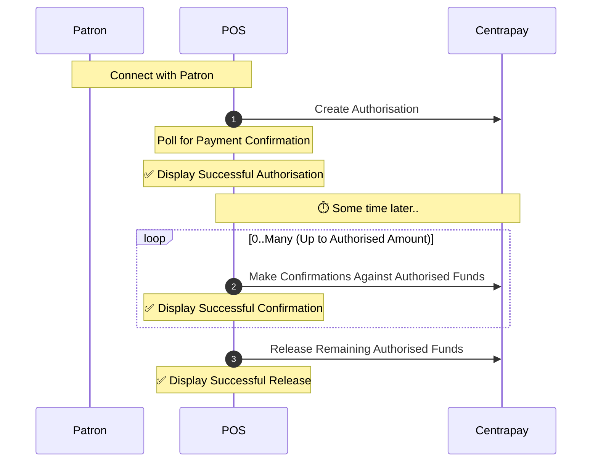
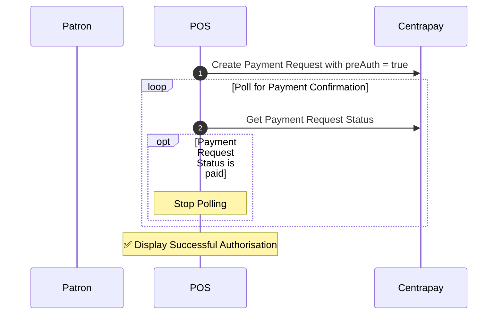
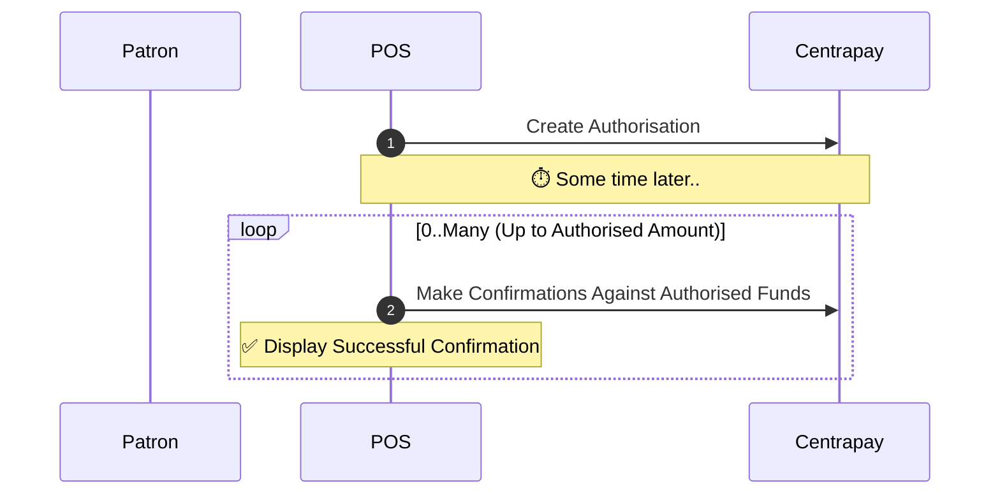
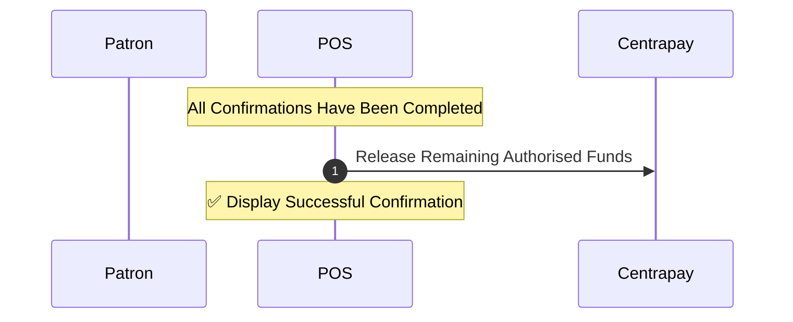

Centrapay’s Pre Auth extension allows a patron to authorise payment up to a limit when the actual payment amount is not yet known.

## Restrictions

Pre Auth payments are not supported in all cases.

1. Not all asset types support Pre Auth - Payment options for [Asset Types](https://docs.centrapay.com/api/asset-types) that do not support Pre Auth will be excluded when a [Payment Request](https://docs.centrapay.com/api/payment-requests#payment-request) is created with the `preAuth` flag.
2. Pre Auth is incompatible with Multi-Asset payments - Only one asset type can be authorised for a Pre Auth.

## Pre Auth Flow

Pre Auth payments go through an orthogonal payment flow compared to Centrapay’s standard payment flow.

> See also: [Requesting Payment](https://www.notion.so/Requesting-Payment-ad4c917a690a4bc3a4de5fc04a7396c2).

1. The POS places a hold on funds by creating an Authorisation.
2. The POS draws down on authorised funds by making Confirmations against the authorisation when the purchase is ready to be fulfilled.
3. The POS releases any remaining funds that have not been confirmed back to the Patron.

### Authorise

An authorisation is created when the [Payment Request is created](https://docs.centrapay.com/api/payment-requests#create-a-payment-request) with the `preAuth` flag while [Requesting Payment](https://www.notion.so/Requesting-Payment-ad4c917a690a4bc3a4de5fc04a7396c2).

Once the authorisation is successful, the Payment Request `preAuthStatus` is set to `authorized`.

### Confirm

Merchants can draw down on authorised funds by making one or more [confirmations](https://docs.centrapay.com/api/payment-requests#make-a-confirmation-against-a-pre-auth-payment-request-experimental) against an authorised amount. Confirmations must be made with an `idempotencyKey` in order to prevent merchants from drawing down on authorised funds twice.

Confirmations against authorised funds have limits:

- Authorisations must be followed up with a confirmation - otherwise, the authorisation will expire and the funds will be returned to the asset holder.

    The `preAuthExpiry` may be adjusted to match pre-determined expiry rules set by the asset provider.

- Multiple confirmations can be performed against an authorisation but the total value cannot exceed the original authorised value.

> Making confirmations is only allowed against authorisations that have had zero or more confirmations made against them.

### Release

Authorised funds that have not been confirmed can optionally be [released](https://docs.centrapay.com/api/payment-requests#release-funds-held-for-a-pre-auth-payment-request-experimental) so that the asset holder is granted access to their remaining funds without needing to wait for the authorisation to expire.

Once releasing any remaining authorised funds is successful, the Payment Request `preAuthStatus` is set to `released`.

> Releasing is only allowed against authorisations that have had zero or more confirmations made against them.

### Expiry

Authorisations automatically expire after 3 months. Any unreleased funds are subsequently released to the Patron.

### Refund

[Refunds](/guides/initiating-refunds) can be made against authorisations, confirmations, released authorisations and expired authorisations.

Refunds made against confirmations must include the `confirmationIdempotencyKey` field that is the same as the `idempotencyKey` used for original confirmation.

### Void

[Voiding a Payment Request](https://docs.centrapay.com/api/payment-requests#void-a-payment-request-experimental) will cancel a Payment Request and trigger any refunds necessary. This operation is useful if the POS needs to back out of a transaction due to a network error for example. Voiding can only be used up to 24 hours after the Payment Request was created.

> Voiding is only allowed against Payment Requests awaiting authorisation and Payment Requests that have been successfully authorised.
