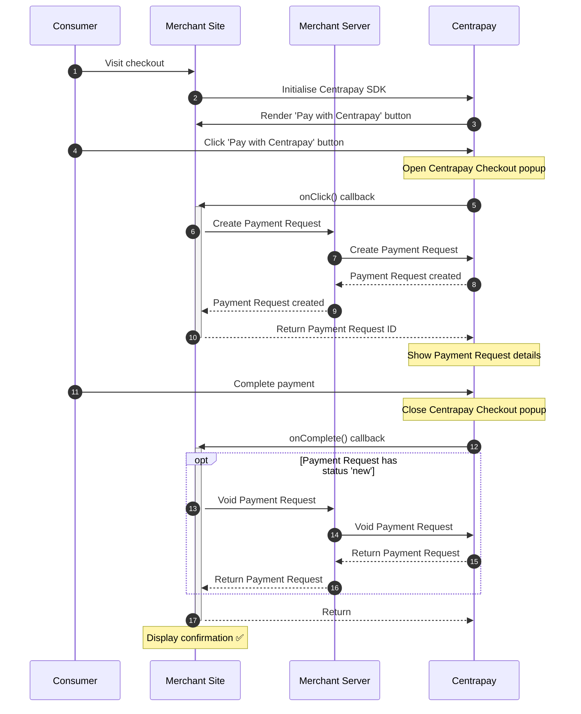

import CodePanel from '../../components/CodePanel.astro';

Centrapay enables businesses to process payments with connected Centrapay assets online. To process online payments, businesses need to integrate with one of our eCommerce payment flows.

> The Centrapay Checkout is under active development and its behavior, functionality, and availability may change without notice.

## Know before you code

Please get in touch with Centrapay to configure your business for eCommerce.
Centrapay will provide you with the following resources to allow you to start creating [Payment Requests](/api/payment-requests).

1. API Key.
2. Merchant Config ID.

> We strongly recommend Centrapay APIs are invoked from your backend where your API key is securely stored.

### Access the Centrapay SDK

The Centrapay SDK enables acceptance of Centrapay payments on your website.
It handles displaying the Centrapay button and launching the Centrapay checkout.

Production: `https://service.centrapay.com/ecommerce/centrapay.js`

## Popup Method

### Overview

You can use the Popup Method to open the Centrapay Checkout in a new browser window.

For desktop applications, the Centrapay Checkout window appears as an overlay on top of the merchant website.
For mobile applications, the Centrapay Checkout opens in a new browser tab.



### Implementation

<CodePanel title="Sample Integration" fullHeight="true">
```html
  <html>
  <head>
    <script src="https://service.centrapay.com/ecommerce/centrapay.js"></script>
  </head>
  <body>
    <div id="centrapay-button-container"></div>
    <script type="text/javascript">
      window.centrapay({
        async onClick() {
          // Create Payment Request
          // Return Payment Request ID
        },
        async onComplete(data) {
          if (data.paymentRequest.status === 'new') {
            // Void Payment Request
          }
        }
      });
    </script>
  </body>
  </html>
```
</CodePanel>

1. Set up the SDK.
    1. Import the Centrapay SDK using a `<script>` tag. This script fetches the necessary JavaScript to access the Centrapay button in the window object.
    2. Add a `div` with the id `centrapay-button-container` to render the ‘Pay with Centrapay’ button.
2. Render the Centrapay button and implement the required callbacks.
    1. `onClick`

        This callback is triggered when the customer clicks the ‘Pay with Centrapay’ button.

        The callback is expected to [Create a Payment Request](/api/payment-requests/#create-a-payment-request) and return the Payment Request ID.
        Our payment protocol supports several optional extensions. Please review the extensions below and determine which ones you need for your integration.
        - [Line Items](https://docs.centrapay.com/guides/line-items)
        - [Requesting Pre Auth](https://docs.centrapay.com/guides/requesting-pre-auth)

    2. `onComplete`

        This callback is triggered when the checkout process finishes or the customer closes the payment popup.
        Your callback will receive a `data` object containing the Payment Request.

        - If the Payment Request is `paid`, you can redirect the customer to the order confirmation page.
        - If the Payment Request is `cancelled` or `expired`, the payment was not completed.
        - If the Payment Request is `new`, you are responsible for [voiding the Payment Request](/api/payment-requests/#void-a-payment-request).


## Contact Us

Contact [integrations@centrapay.com](mailto:integrations@centrapay.com) to configure your business for eCommerce.

Once you have confirmed your integration needs, we will provide you with a customized integration checklist for certification.
Accepting live payments requires you to meet our certification requirements.
