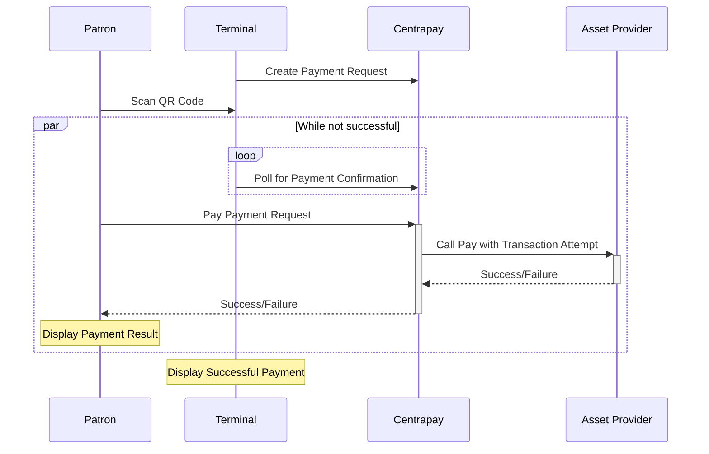

import CodePanel from '../../components/CodePanel.astro';

By integrating with Centrapay as a third-party asset provider, you can take advantage of our connections with terminals, point-of-sale systems, and merchant networks, thereby expanding the reach of your digital asset to a wider audience.

Once you have defined your asset as a [Payment Method](#defining-a-payment-method) with Centrapay and implemented the required [Uplink APIs](#uplink-api-spec), consumers will be able to spend your digital asset using one of our payment flows wherever merchants accept your digital asset.

## Defining a Payment Method

We require a way of identifying your asset in order to route payments to the correct asset provider. You must define a payment method namespace, description, and list of supported currencies.

### Namespace

The namespace is a unique string to identify your asset. Your namespace must conform to the following properties:

- Alphanumeric characters.
- No punctuation except for `-`.
- Must not end in reserved keywords `test` or `main`.
- Must not conflict with [existing names](/api/asset-types/).

Your payment method namespace may have a connection to your brand or product. Centrapay reserves the right to decline a requested namespace.

Valid examples are `centrapay-example` or `bitcoin`.

### Liveness

The liveness of a payment method can be either main or test. This can be used to accept test assets through Centrapay.

- Test and main assets must share the same namespace but end in `test` or `main`. For example, `centrapay.main` and `centrapay.test`.
- Integrating a test asset is optional.
- A set of uplink APIs must be provided for both main and test.
- [Centrapay Merchants](/api/merchants/) need a test flag in order to accept test assets.

### Description

Merchants may look at reports or receipts of past transactions. If there was a payment or refund with your asset against their Payment Request, the description of your asset will be displayed.

Your description cannot exceed 15 characters.

An example description is `Centrapay NZD`, `Bitcoin`, or `Ethereum`.

### Supported Currencies

[Payment Requests](/api/payment-requests/) have a value determined by the currency a Merchant accepts. You should supply a finite list of three-letter [ISO currency codes](https://en.wikipedia.org/wiki/ISO_4217) that is supported by your asset.

### Example Definition

| Field                                         | Type   | Description                                                         | Examples          |
| --------------------------------------------- | ------ | ------------------------------------------------------------------- | ----------------- |
| [Namespace](#namespace)                       | String | A name used for uniquely identifying the asset as a payment method. | centrapay-example |
| [Description](#description)                   | String | A short human readable description.                                 | Centrapay Money   |
| [Supported Currencies](#supported-currencies) | Array  | A list of supported currency codes.                                 | NZD, USD          |

## Uplink API Requirements

To integrate with Centrapay payments, you must implement the Uplink endpoints. An Uplink is a strategy for performing payment or refund transactions for your Asset. These endpoints will be used in the lifecycle of a payment.

Requirements specific to an endpoint will be stated in the API specification.

Integrations are required to tolerate any unknown fields. Over time as new functionality is added, we reserve the right to add fields to API models. You can expect us to notify you of modelling changes.

### Contact Details

Centrapay requires at least one email address to notify you of integration failures or changes. You may choose to provide us with multiple emails for different priorities of communication.

### Protocol

Each endpoint must use the HTTPS protocol.

### URL

There are no restrictions regarding the provided URLs, so long as they adhere to the specification for the HTTP method, query parameters, request body, response body, and error codes.

### Authentication

Endpoints are authenticated against requests using a JSON Web Token (JWT) issued by Centrapay. The JWT will be sent through the `Authorization` header in the HTTP Request.

Verify the JWT using the public key returned for the JSON Web Key Set (JWKS) endpoint with the matching `kid`.

Keys used for signing JWTs may be rotated without warning, therefore it is required that signatures are resolved dynamically against the JWKS endpoint. You may choose to cache the result, but respect the directives in the http cache-control headers.

<CodePanel title="JWKS Request" method="GET" path="/api/.well-known/jwks.json">
  ```bash
  curl https://auth.centrapay.com/api/.well-known/jwks.json
  ```
</CodePanel>

<CodePanel title="JWKS Response">
  ```json
  {
    "keys": [
      {
        "kty": "EC",
        "x": "t-vW2fE0mLLmdzJtYrz7J9q_yEXlgmIjCXdv3VNvYfQ",
        "y": "7GgTuTyTYmg95fZQ_D8xELt9Xj7DhvNZg1bqONPnYC4",
        "crv": "P-256",
        "kid": "20191127-07baec395",
        "use": "sig",
        "alg": "ES256"
      }
    ]
  }
  ```
</CodePanel>

To verify a request start by decoding the JWT.

<CodePanel title="Decoded JWT Payload">
  ```json
  {
    "iat": "1684105185",
    "exp": "1684105485",
    "aud": "https://your.endpoint",
    "request_body_sha256": "b9195bf41bf0e38ab0ab44e7ef5b9af5cb0fe2ece8dee5d112d7485bf4ef0007",
  }
  ```
</CodePanel>

|        Field        |                                                Description                                                |
| ------------------- | --------------------------------------------------------------------------------------------------------- |
| iat                 | An Unix timestap of the request's creation.                                                               |
| exp                 | An Unix timestap that the request is vaild until. Set to 5 minutes after iat.                             |
| aud                 | The Uplink API URL belonging to the intended recipient of the request.                                    |
| request_body_sha256 | A hash of the request payload, created using the [SHA256 algorithm](https://en.wikipedia.org/wiki/SHA-2). |

Use the decoded JWT fields to validate the following:

Exp is provided as a default expiry. Alternatively, use iat + your own expiry window to determine if the JWT has expired.

Assert that the audience is correct by checking that aud is equal to the base URL of your Uplink API.

The request_body_sha256 property should be used to verify that the request payload has not been tampered with. This should be done by hashing the received request payload using the SHA256 algorithm and checking for equality with request_body_sha256 as shown below.

<CodePanel title="Example">
  ```javascript
  const crypto = require("crypto");

  const decodedJwt = {
    request_body_sha256: "d4735e3a265e16eee03f59718b9b5d03019c07d8b6c51f90da3a666eec13ab35",
  };

  const payload = {
    vader: "I am your father",
    luke: "That's not true, that's impossible",
  };

  const jsonStringPayload = JSON.stringify(payload);

  const hashedPayload = crypto.createHash("sha256").update(jsonStringPayload).digest("hex");

  if (decodedJwt["request_body_sha256"] != hashedPayload) {
    throw new Error("Payload hashes do not match");
  }
  ```
</CodePanel>

If any of the above assertions are not met the request must be rejected.

### Error Codes

You may define the errors thrown from each endpoint. If an error is received, Centrapay will [get the Transaction Status](#get-transaction-endpoint) and decide whether to retry based on the response.

Centrapay will retry a transaction attempt when a HTTP response status code ≥ 500 is thrown.

### Settlement

It is the responsibility of the Asset Integrator to settle funds with a merchant.

### Transaction Idempotency

An idempotency key is used for `HTTP POST` requests. Centrapay **does not** guarantee endpoints will be called only once per transaction. It is expected that you will enforce transaction idempotency. In the event that the idempotency is violated, Centrapay expects a `200 OK` response as described in the endpoint specification.

## Uplink API Spec

### Transaction Attempt Model

> Integrations are required to tolerate any unknown fields. This is so we can maintain forwards compatibility with endpoints as we add to the API specification without versioning.

| Name           | Type                                                            | Necessity | Description                                                                                              |
| -------------- | --------------------------------------------------------------- | --------- | -------------------------------------------------------------------------------------------------------- |
| currency       | String                                                          | required  | The three letter [ISO curreny code](https://en.wikipedia.org/wiki/ISO_4217) for the payment.             |
| amount         | String                                                          | required  | The value required to pay in the smallest denomination for the supported currency (e.g. cents).          |
| authorization  | String                                                          | required  | A reference to the asset of the party paying the Payment Request.                                        |
| merchantName   | String                                                          | required  | The name of the merchant who created the Payment Request.                                                |
| merchantId     | String                                                          | required  | Your identifier for the merchant receiving payment.                                                      |
| idempotencyKey | String                                                          | required  | A unique value that can be used to recognise subsequent retries of the same request.                     |
| transactionId  | String                                                          | required  | An ID for the transaction in Centrapay’s system.                                                         |
| status         | String                                                          | required  | The status of the asset transaction. See [possible status values](#statuses).                            |
| type           | String                                                          | required  | The type of transaction. Possible values are payment or refund.                                          |
| failureReason  | String                                                          | optional  | Required if the status is failed. See [possible failure reasons](#failure-reasons).                      |
| refundable     | Boolean                                                         | optional  | Required if type is payment and status is successful. A flag indicating whether a payment is refundable. |
| refundBefore   | [Timestap](https://docs.centrapay.com/api/data-types#timestamp) | optional  | The latest time at which a refund can be initiated.                                                      |

### Statuses

| Name       | Description                                                                                                                      |
| ---------- | -------------------------------------------------------------------------------------------------------------------------------- |
| pending    | The transaction is processing.                                                                                                   |
| successful | The transaction has been successfully processed.                                                                                 |
| failed     | The transaction has been unable to be successfully processed. A failure reason is expected to be provided when status is failed. |

### Failure Reasons

See endpoint spec for possible failure reasons.

### Pay Endpoint

This endpoint is used to initiate payment. If payment is completed asynchronously, the status will be `pending` and the [get transaction endpoint](#get-transaction-endpoint) will be used to poll until the status is `successful` or `failed`.



<CodePanel title="Request" method="POST" path="/pay">
```bash
curl -X POST https://your.endpoint/pay \
	-H "Authorization: ${jwt}" \
	-H "Content-Type: application/json" \
	-d '{
		"currency": "NZD",
		"amount": "1000",
		"authorization": "WRhAxxWpTKb5U7pXyxQjjY",
		"merchantName": "Centrapay Cafe",
		"merchantId": "MhocUmpxxmgdHjr7DgKoKw",
		"idempotencyKey": "VMXMkUttDGTVz4ESv5ND56",
		"transactionId": "UttDGTHjr7DgKoKwWpTKb"
  }'
```
</CodePanel>

<CodePanel title="Response">
```json
{
  "currency": "NZD",
  "amount": "1000",
  "authorization": "WRhAxxWpTKb5U7pXyxQjjY",
  "merchantName": "Centrapay Cafe",
  "merchantId": "MhocUmpxxmgdHjr7DgKoKw",
  "idempotencyKey": "VMXMkUttDGTVz4ESv5ND56",
  "transactionId": "UttDGTHjr7DgKoKwWpTKb",
  "type": "payment",
  "status": "successful",
  "refundable": true,
  "refundBefore": "2023-06-09T00:52:22.468Z"
}
```
</CodePanel>

**Failure Reasons**

| Name                     | Description                                                                                                                             |
| ------------------------ | --------------------------------------------------------------------------------------------------------------------------------------- |
| INSUFFICIENT_ASSET_VALUE | The patron does not have the sufficient asset amount to complete the transaction.                                                       |
| ASSET_REDEMPTION_DENIED  | The asset redemption has been unsuccessful due to the provided payment parameters e.g. currency not supported or unknown authorization. |

### Refund Endpoint

This endpoint is used to refund a Payment Request with status `paid`. Refunds must be synchronous i.e. the status must be `successful` or `failed`.

It is expected that partial refunds are supported.

<CodePanel title="Request" method="POST" path="/refund">
```bash
curl -X POST https://your.endpoint/refund \
	-H "Authorization: ${jwt}" \
	-H "Content-Type: application/json" \
	-d '{
		"currency": "NZD",
		"amount": "1000",
		"paymentTransactionId": "HFCD73hsbJHBDd9gs3t",
		"idempotencyKey": "dDHF8743fVzdsg84f6"
	}'
```
</CodePanel>

<CodePanel title="Response">
```json
{
  "currency": "NZD",
  "amount": "1000",
  "authorization": "WRhAxxWpTKb5U7pXyxQjjY",
  "merchantName": "Centrapay Cafe",
  "merchantId": "MhocUmpxxmgdHjr7DgKoKw",
  "transactionId": "HFCD73hsbJHBDd9gs3t",
  "idempotencyKey": "dDHF8743fVzdsg84f6",
  "type": "refund",
  "status": "successful"
}
```
</CodePanel>

**Failure Reasons**

| Name                        | Description                                                                                    |
| --------------------------- | ---------------------------------------------------------------------------------------------- |
| PARTIAL_REFUNDS_NOT_ALLOWED | The Amount provided is less than the value of the payment and partial refunds are not allowed. |

### Cancel Endpoint

After initiating a transaction with the pay endpoint, the status may be `pending`. During this time something may have happened to prevent the payment request from being paid (e.g. payment request timeout or merchant network issues).

The Cancel endpoint can be used to stop processing a transaction that has status `pending`. If the Cancel endpoint is called for a transaction that already has `successful` or `failed`, it is expected that an error will be thrown.

Once the Cancel endpoint is called, the transaction status should be `failed`. This is a synchronous call and cannot return status `pending`. The reason for cancellation will be passed through as a failureReason.

**Example Request**

<CodePanel title="Request" method="POST" path="/cancel">
```bash
curl -X POST https://your.endpoint/cancel \
	-H "Authorization: ${jwt}" \
	-H "Content-Type: application/json" \
	-d '{
		"transactionId": "UttDGTHjr7DgKoKwWpTKb",
		"failureReason": "PAYMENT_REQUEST_EXPIRED"
	}'
```
</CodePanel>

<CodePanel title="Response">
```json
{
  "currency": "NZD",
  "amount": "1000",
  "authorization": "WRhAxxWpTKb5U7pXyxQjjY",
  "merchantName": "Centrapay Cafe",
  "merchantId": "MhocUmpxxmgdHjr7DgKoKw",
  "idempotencyKey": "VMXMkUttDGTVz4ESv5ND56",
  "transactionId": "UttDGTHjr7DgKoKwWpTKb",
  "type": "payment",
  "status": "failed",
  "failureReason": "PAYMENT_REQUEST_EXPIRED"
}
```
</CodePanel>

**Failure Reasons**

| Name                    | Description                                                 |
| ----------------------- | ----------------------------------------------------------- |
| CANCELLED_BY_MERCHANT   | The merchant has initiated a cancel of the payment request. |
| PAYMENT_REQUEST_EXPIRED | The payment request has expired before being paid.          |

### Get Transaction Endpoint

After initiating a payment transaction, the status may be `pending`. This endpoint will be used to poll the status of the transaction attempt. Polling will continue until either the transaction attempt status is `successful` or `failed`, or the Centrapay Payment Request is no longer payable (e.g. it has expired).

<CodePanel title="Request" method="GET" path="/get?transactionId=${transactionId}">
```bash
curl https://your.endpoint/get?transactionId=UttDGTHjr7DgKoKwWpTKb
	-H "Authorization: ${jwt}"
```
</CodePanel>

<CodePanel title="Response">
```json
{
  "currency": "NZD",
  "amount": "1000",
  "authorization": "WRhAxxWpTKb5U7pXyxQjjY",
  "merchantName": "Centrapay Cafe",
  "merchantId": "MhocUmpxxmgdHjr7DgKoKw",
  "idempotencyKey": "VMXMkUttDGTVz4ESv5ND56",
  "transactionId": "UttDGTHjr7DgKoKwWpTKb",
  "type": "payment",
  "status": "successful",
  "refundable": "true",
  "refundBefore": "2023-06-09T00:52:22.468Z"
}
```
</CodePanel>

## Implementation Checklist

To enable merchants to accept your asset as a payment method, you must complete an integration certification. When you're ready or need assistance/have questions integrating, please contact the Centrapay Engineering team at integrations@centrapay.com.

- Payment Method
  - Namespace
  - Description
  - Supported Currencies
- Uplink urls for main liveness payment method
- (Optional) Uplink urls for test liveness payment method
- An email address to contact for API spec enhancements
