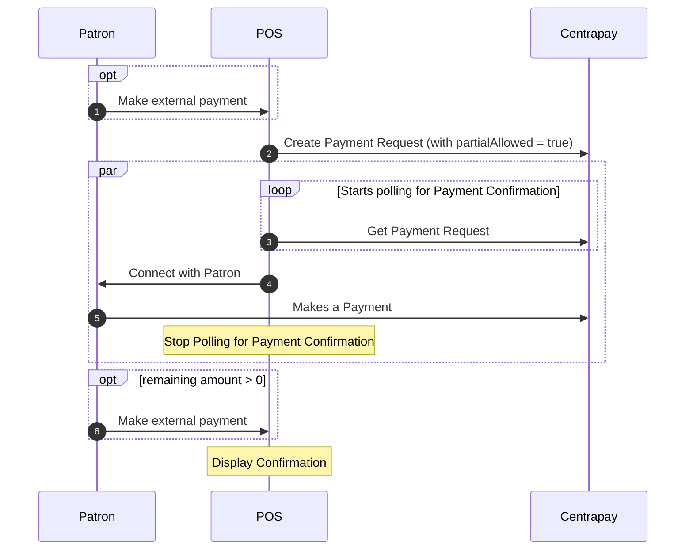

Partial Payment is an extension to the Payment Request Protocol that allows
customers to utilize different forms of payment. This allows Centrapay Payments
to easily complement other methods of payment. In addition
leveraging this with payment methods such as
[Tokens](https://docs.centrapay.com/api/assets#tokens-experimental) will allow you
to gain valuable insights into customer spending behaviour.

If a customer wants to pay with Centrapay but finds they lack sufficient funds
to cover the full payment, enabling Partial Pay offers a practical solution.
Instead of canceling the Payment Request and starting over, the customer can
make a partial payment using their available funds. Once the Centrapy payment
is successful, you can proceed to take payment for the remaining balance using
another method.

## Implementation

### Create Payment Request

When [creating a Payment Request](https://docs.centrapay.com/api/payment-requests#create-a-payment-request)
you can opt into partial payment by following these steps:

- Set `partialAllowed` to true.
- Set `value.amount` to the amount payable with Centrapay.
- Set `basketAmount` to the purchase total, including other forms of payment
(e.g., cash or card). If the customer intends to pay the total purchase via
Centrapay this should be equal to `value.amount`.

If the customer has already paid for part of the transaction by another method
or indicates they would like to pay only a part of the transaction with Centrapay,
then `value.amount` should be less than the `basketAmount`.

If you are integrating with the [Line Items payment extension](/guides/line-items),
the total amount of line items must sum to either the `basketAmount` or the
`value.amount`.

### Get Payment Request

Integrators should continue to poll [get Payment Request](https://docs.centrapay.com/api/payment-requests#get-a-payment-request)
until the status is no longer `new`. If the Payment Request status has been
updated to `cancelled` or `expired`, proceed as describe in [requesting a payment](/guides/requesting-payment#polling-for-payment-confirmation).
If the status is `paid` you need to check the `remainingAmount` property on the
Payment Request.

- If `remainingAmount` is 0, then the entire amount requested via Centrapay
has been paid.
- If `remainingAmount` is greater than 0, then there is an outstanding balance
you will need to request payment via other means. If the customer cannot complete
the transaction via other means then you should
[refund](https://docs.centrapay.com/api/payment-requests#refund-a-payment-request)
the Payment Request.

## See also

- [Point of sale](/guides/point-of-sale/)
