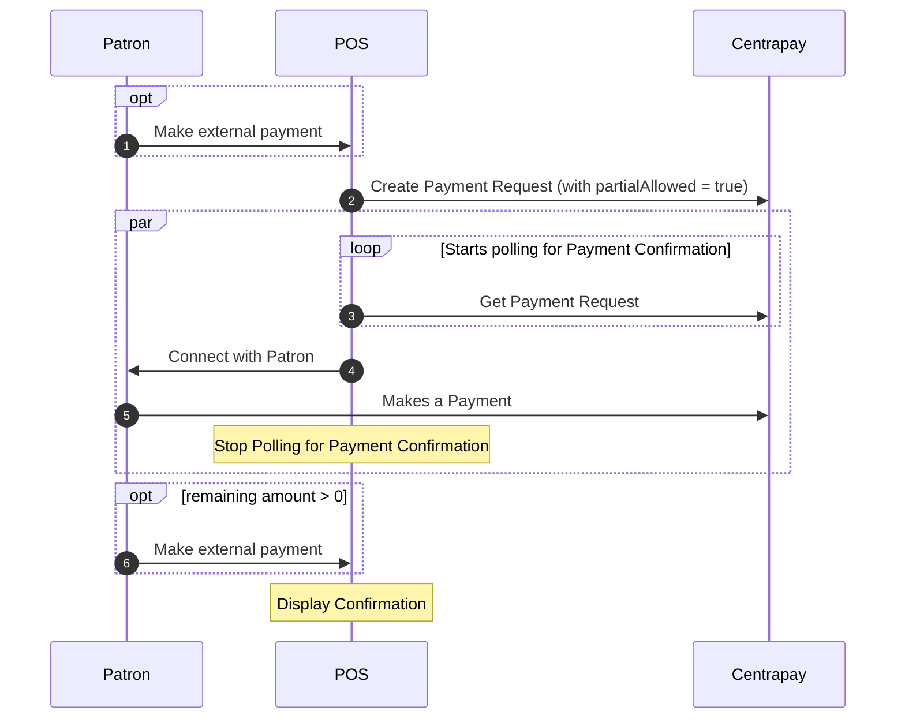

Partial Payment enables patrons to pay using other payment options alongside
Centrapay.

Partial Payment is a core feature of Centrapay’s payment protocol. Integration
is required to allow acceptance of Centrapay Assets that relate to specific
Line-Items such as Tokens.

This offers a practical solution for point of sale systems to support three
different experiences, including merchant driven and app driven partial payments
or a hybrid of both.

Following the implementation guide below will enable all three supported scenarios.

## Partial Payment Flow

### Merchant Driven Scenario
A patron asks the merchant to process a specified part of the total basket
amount using Centrapay. This could be due to the patron knowing their Centrapay
Asset balance wouldn’t cover the complete basket amount or enable them to use a
set amount of funds from a fixed value asset eg. Gift Card to complete the payment.
**Related steps in diagram above:** 1→2→3→4→5 or 2→3→4→5→6

### Patron Driven Scenario
A patron using a mobile wallet app may find they lack enough funds to cover the
full payment after connecting to a Centrapay Payment Request. Instead of the
cashier needing to cancel the Payment Request and start over, the patron can
make a partial payment with available funds. Once the Centrapay payment is
successful, the point of sale can take payment for the remaining amount using
another method.
**Related steps in diagram above:** 2→3→4→5→6

### Hybrid Partial Payment Scenario
A combination of Merchant and App driven partial payments to cater for edge
cases where needed.
**Related steps in diagram above:** 1→2→3→4→5→6

## Implementation

### Creating the Payment Request

When [creating a Payment Request](/api/payment-requests#create-a-payment-request),
opt into partial payment by:

- Setting `partialAllowed` to true.
- Setting `value.amount` to the amount payable via Centrapay.
- Setting `basketAmount` to the total amount of the transaction, including external
forms of payment, e.g., cash or card. This value should be equal to `value.amount`
if the patron is completing their entire transaction using Centrapay.

If the patron has paid by another method or indicates they would like to pay
a part the transaction with Centrapay, then `value.amount` should be less than
the `basketAmount`.

If you are integrating with the [Line Items payment extension](/guides/line-items),
the total amount of line items must sum to either the `basketAmount` or the
`value.amount`.

### Polling for Payment Confirmation

Continue to poll the status of the Payment Request until it is no longer `new`.
If the Payment Request status has been updated to `cancelled` or `expired`,
proceed as you normally would. If the status is `paid` you need to check the
`remainingAmount` property on the Payment Request.

- If it is 0, then the entire amount requested via Centrapay has been paid.
- If it is greater than 0, you will need to request the remaining amount from
the patron via another payment option. If the patron cannot complete the
transaction then the payment request should be [refunded](/api/payment-requests#refund-a-payment-request).

## See also

- [Point of sale](/guides/point-of-sale/)
