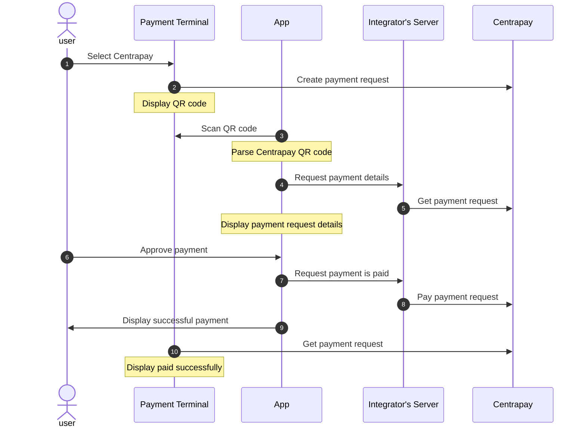

## Overview

This guide is for a [Third-party Asset Provider](/guides/integrating-third-party-asset) to enable paying with their
digital assets with Centrapay.

## Authenticating API calls on behalf of users

Third-party applications can make API calls on behalf of users with Centrapay
API keys. All API requests to Centrapay must be made from the integrator’s server.
Centrapay API keys must also be managed server side and stored as secrets to
minimize the risk of API keys being compromised.

Separate API keys will be used for test and live payments.

> Contact [integrations@centrapay.com](mailto:integrations@centrapay.com) to be issued your API keys.

## Payment Flow Overview

The payment flow below describes how a Third-party Asset Provider should integrate
with the [Dynamic Merchant QR Code flow](/guides/payment-flows#dynamic-merchant-qr-code) to enable digital payments within their
application. Below is an overview of the process, followed by a more in-depth
look at the integrator’s responsibilities.

1. User selects Centrapay on the terminal at a participant merchant
2. The payment terminal creates a payment request with Centrapay on behalf of the merchant
   and displays a QR code.
3. User scans the QR code with their app.
4. App sends the payment request id from the QR code to the server requesting
   the details of the payment.
5. The server [gets the payment request](https://docs.centrapay.com/api/payment-requests#get-a-payment-request)
   from Centrapay.
6. The user views the payment details on their app and approves the payment.
7. The app requests the server pay the payment request
8. The server [Pays the Payment Request](https://docs.centrapay.com/api/payment-requests#pay-a-payment-request)
   with the users asset
9. The app displays a successfully paid screen to the user
10. The terminal gets the payment request and display successfully paid

## Payment Flow Implementation

### Scan Centrapay QR code

The user will then scan the QR code from inside the app. The valid Centrapay QR Code
will have the format `https://app.centrapay.com/pay/{paymentRequestId}`. Validate
the url by asserting it matches the format and ignore any malformed QR codes.

### Get the Payment Request

Once the app has validated the url, use the id of the Payment Request to
call the [Get Payment Request](https://docs.centrapay.com/api/payment-requests#get-a-payment-request)
API from your server. The returned [PaymentRequest model](https://docs.centrapay.com/api/payment-requests#payment-request)
will provide the details needed to determine if the payment request can be completed.

| Field          | Used for                                                                                                                                                                                                                                                                        |
| -------------- | ------------------------------------------------------------------------------------------------------------------------------------------------------------------------------------------------------------------------------------------------------------------------------- |
| status         | If the status is `new` the Payment Request is able to be paid, if it is `cancelled`, `expired`, or `paid` it is in a final state and payments can no longer be made against the Payment Request                                                                                 |
| paymentOptions | The Payment Options define what Assets a merchant accepts. If your Asset’s type is in the Payment Options array, it is able to be used for payment. If your Asset’s type is not in the Payment Options then the merchant has not been configured to accept your payment method. |
| liveness       | Determines whether a Payment Request is a test Payment Request. Test Payment Requests can only be paid with test assets, and should not be displayed to end users.                                                                                                              |

### Pay the Payment Request

If the Payment Request is payable with your Asset then you should display the
Payment Request details to the user. Some relevant fields to display are:

| Field        | Used for                                                                                                                        |
| ------------ | ------------------------------------------------------------------------------------------------------------------------------- |
| merchantName | The name of the merchant the user is paying                                                                                     |
| value        | The currency and amount the merchant is request, which may need to converted to the denomination of the asset used for payment. |

Once a user has seen the relevant information and confirmed payment you should invoke the
[Pay Payment Request API](https://docs.centrapay.com/api/payment-requests#pay-a-payment-request)
from the server on behalf of the user with the following fields:

| Field         | Used for                                                                                                                                              |
| ------------- | ----------------------------------------------------------------------------------------------------------------------------------------------------- |
| assetType     | The Asset Type defined when you registered your third party asset.                                                                                    |
| authorization | An identifier for your Asset Type which will be used when invoking the https://docs.centrapay.com/guides/integrating-third-party-asset/#pay-endpoint. |

If the payment was successful then the status of the payment request will be `paid`
and you can show confirmation of payment to the user.

## Payment Extensions

Extensions to the payment protocol can be used to enhance the user's experience
by providing alternative payment flows.

### Partial Pay

If both your app and the merchant support [Partial Pay](/guides/partial-payment-extension/)
then you may allow the user to pay only a portion of the payment request and
then pay the remaining amount with an alternative payment method.

The `partialAllowed` flag on the payment request will determine if the merchant
allows partial payments. If they don’t then you should only allow paying the entire
payment request.

To pay a partial amount of the payment request pass the mode and amount to the pay
payment request API.

| Field  | Used for                                                                                           |
| ------ | -------------------------------------------------------------------------------------------------- |
| mode   | For partial payments the mode should be `partial`                                                  |
| amount | For partial payments you must provide the amount of the Payment Request you want to partially pay. |

The `remainingAmount` property on the payment request can be used to show how much
the user still needs to pay with an alternative method.

## Testing

Centrapay supports test resources that can be used for integration testing. A test
merchant will be provided that accepts test payments. If you have supplied a
test third-party asset then this merchant can be configured to accept it as a
payment method.

The [Centrapay Business Portal](https://app.centrapay.com/business) or APIs can
be used in place of a payment terminal to test the app.
