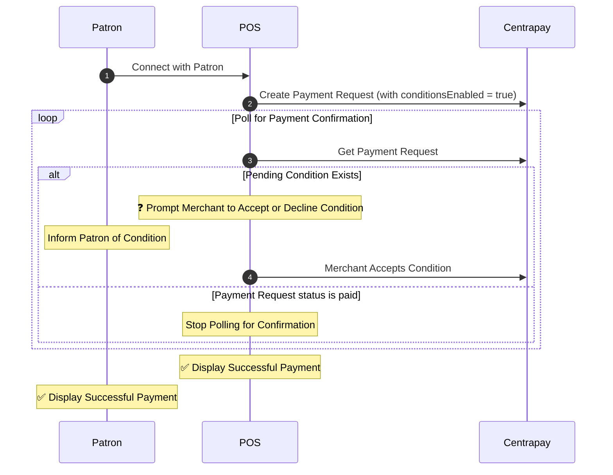

Some [Asset Types](/api/asset-types) such as tokens or closed-loop cards may require conditional operator approval. Merchant integrations are required to support [Payment Conditions](/api/payment-requests#payment-condition) for these asset types in order for them to be accepted for payment.

Examples of Payment Conditions include:

- The merchant needs to confirm proof of identification for age-restricted purchases.
- The merchant needs to confirm that a promotional item was purchased.
- The patron needs to confirm the payment from their Centrapay integrated app.

## Implementation

In order to support Payment Conditions, the merchant integration must extend Centrapay's payment protocol by [creating the Payment Request](/api/payment-requests#create-a-payment-request) with the `conditionsEnabled` flag set to true.

The example flow below assumes that the merchant integration has first connected with the patron when [Requesting Payment](/guides/requesting-payment) using the [QR Code Flow for Merchants](/guides/merchant-integration-qr-code-flow) or the [Barcode Flow for Merchants](/guides/merchant-integration-barcode-flow).

When Payment Conditions are present on a [Payment Request](/api/payment-requests#payment-request), merchant integrations and consumer apps need to negotiate them with their respective parties using the `status` of each condition.

1. **Prompt**

    Merchant integrations should prompt the terminal operator to [accept](/api/payment-requests#accept-payment-condition-for-a-payment-request-experimental) or [decline](/api/payment-requests#decline-payment-condition-for-a-payment-request-experimental) any conditions that have status `awaiting-merchant`.

    Consumer apps should inform the patron to [accept](/api/payment-requests#accept-payment-condition-for-a-payment-request-experimental) or [decline](/api/payment-requests#decline-payment-condition-for-a-payment-request-experimental) any conditions that have status `awaiting-patron`.

2. **Inform**

    Merchant integrations should inform the terminal operator of any conditions that have status `awaiting-patron` using the `message` provided with the condition.

    Consumer apps should inform the patron of any conditions that have status `awaiting-merchant` using the `message` provided with the condition.

3. **Repeat** the above steps when polling shows conditions have changed.

## Additional Behaviors

The payment request status must always be polled after [accepting](/api/payment-requests#accept-payment-condition-for-a-payment-request-experimental) or [declining](/api/payment-requests#decline-payment-condition-for-a-payment-request-experimental) a condition as these actions may trigger the additional behaviors below.

- Conditions can be linked such that they are added or voided due to state changes on the [Payment Request](/api/payment-requests#payment-request). Note that accepting or declining a voided condition will fail.
- The [Patron Not Present extension](/guides/patron-not-present) may prevent the presentation of conditions that are impossible to satisfy such as checking photo ID.
