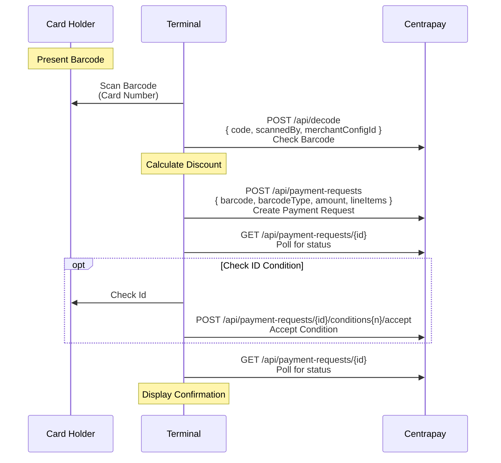

Transacting via Centrapay requires customer and merchant devices to negotiate the creation and fulfillment of Payment Requests. There are multiple payment “flows” a merchant integration can select from to facilitate this negotiation. Which flow is employed will depend on the capabilities of the merchant system.

## Merchant-presented

When a merchant terminal has a customer-facing display it can prompt the customer to pay by showing a QR code.

### Dynamic Merchant QR Code

1. Merchant terminal [creates a payment request](https://docs.centrapay.com/api/payment-requests#create-a-payment-request) via Centrapay API and shows QR code on customer-facing display.
2. Customer device scans the QR code, fetches the [payment request details](https://docs.centrapay.com/api/payment-requests#get-a-payment-request), and [completes payment](https://docs.centrapay.com/api/legacy-payment-requests#requests-pay) as normal.
3. Merchant terminal displays transaction result using the [payment request details](https://docs.centrapay.com/api/payment-requests#get-a-payment-request).

### Static Merchant QR Code

When a merchant terminal is neither capable of displaying nor scanning QR codes or barcodes, such as for unattended vending machines, then a static QR code can be used.

1. Customer scans QR code and initiates vending sequence via Centrapay API, with the merchant code as a parameter.
2. Merchant vending system initiates payment request via Centrapay API.
3. Customer device fetches payment request and completes payment as normal.
4. Merchant vending system optionally initiates refund via Centrapay API.

## Patron-presented

When a merchant terminal is not capable of displaying a customer-facing QR code, then the payment request can be negotiated with the customer by scanning a barcode or QR code displayed on the customer’s smart device.

### Dynamic Patron Barcode

1. Customer generates a short-lived [Patron Code](https://docs.centrapay.com/api/patron-codes) via Centrapay API and displays it as a barcode on their smart device
2. Merchant scans the barcode, optionally checks for support using the [Scanned Codes](https://docs.centrapay.com/api/scanned-codes#decode-scanned-code) endpoints for additional information on the patron, and then [creates a Payment Request](https://docs.centrapay.com/api/payment-requests#create-a-payment-request) via Centrapay API with the barcode as a parameter.
3. Customer device [fetches the payment request](https://docs.centrapay.com/api/payment-requests#get-a-payment-request) created with the Patron Code and completes payment as normal.

### Static Patron Barcode

This is a variant on Dynamic Patron Code. If you’ve setup a long lived Centrapay Enabled Barcode then you can use these to pay on behalf of a Customer. You may need to check a Customer’s Photo ID before this goes through.

1. Customer presents a Centrapay Enabled Barcode and it is scanned by the Merchant.
2. Merchant checks the barcode for support using the [Scanned Codes](https://docs.centrapay.com/api/scanned-codes#decode-scanned-code) endpoints.
3. Merchant then [creates a Payment Request](https://docs.centrapay.com/api/payment-requests#create-a-payment-request) using the barcode as a parameter.
4. Merchant [polls for the Payment Request](https://docs.centrapay.com/api/payment-requests#get-a-payment-request) created with the barcode checking the status.
5. Merchant will have to call endpoints to [accept a Payment Condition](https://docs.centrapay.com/api/payment-requests#accept-payment-condition) if there are [Payment Conditions](https://docs.centrapay.com/api/payment-requests#payment-condition) on the Payment Request and the condition has an `awaiting-merchant` status.
6. Once the status on the Payment Request is “paid” then the process is complete.

### Quick Pay

Quick Pay is used to pay the payment request after it is polled for the first time, without requiring patron approval. Quick Pay can only be triggered using the patron-presented flows, and the patron barcode must be linked to an asset type that allows quick pay.

See [Asset Types](https://docs.centrapay.com/api/asset-types) for the list of asset types that support Quick Pay.
