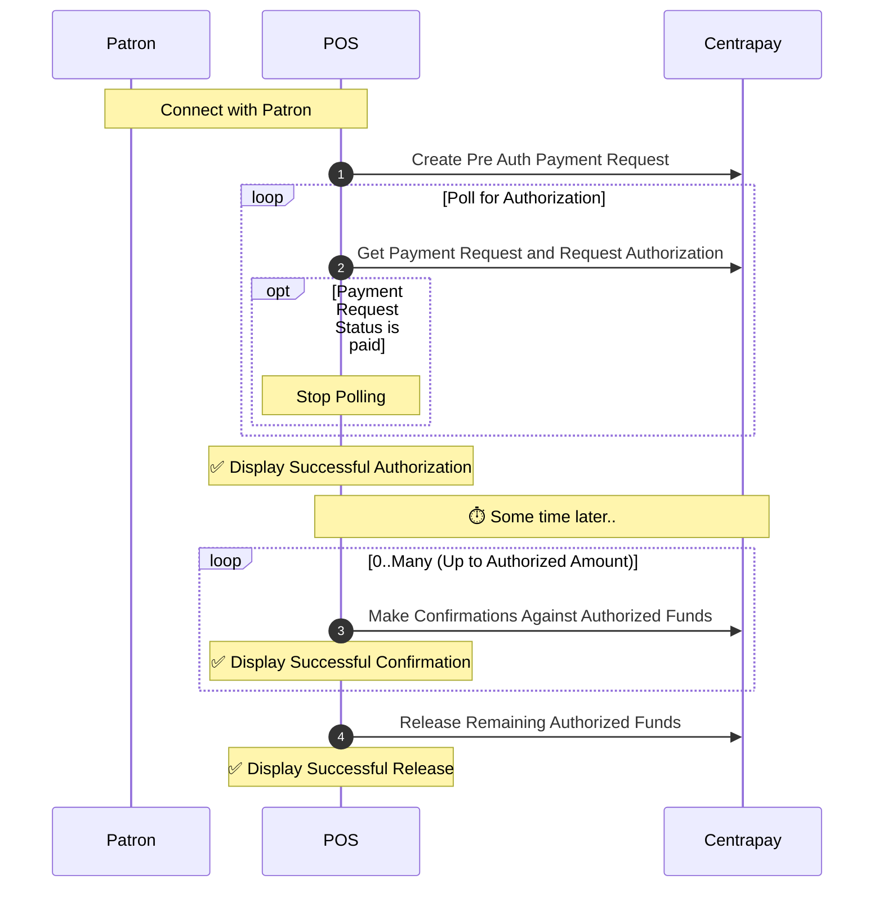
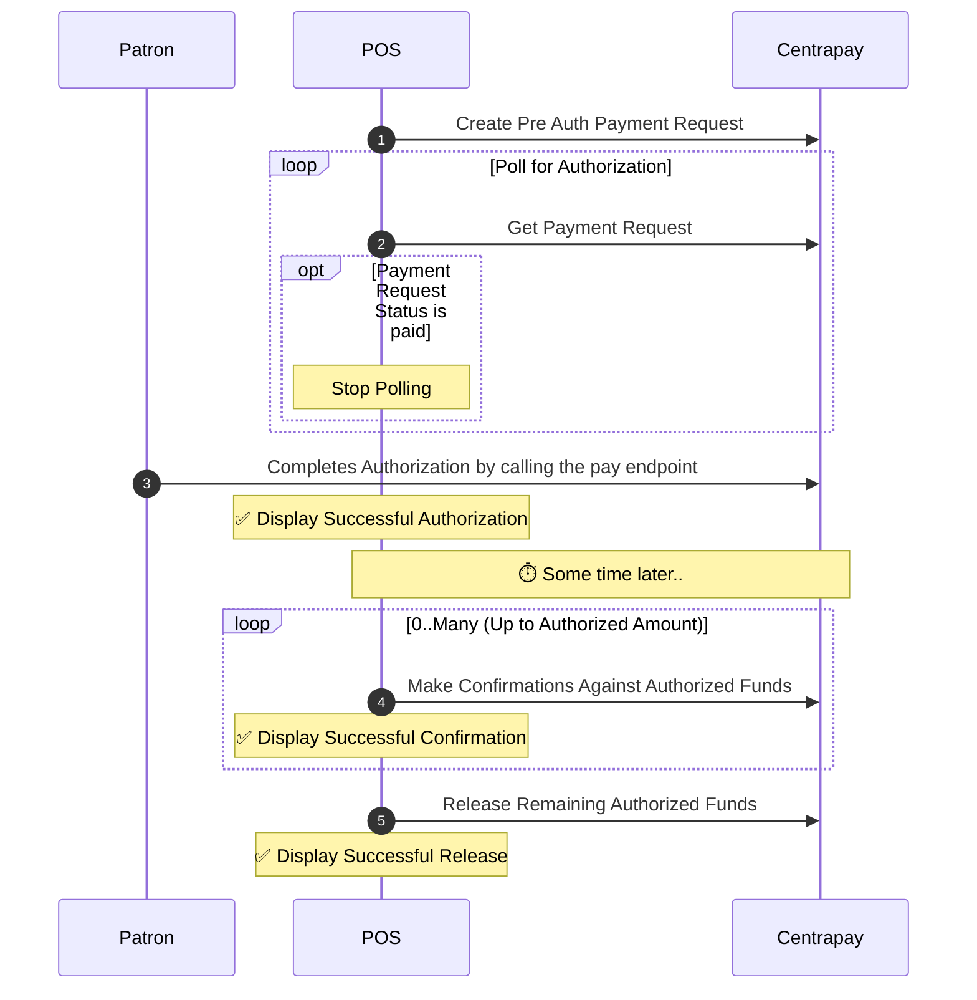

Centrapay’s Pre Auth extension allows a patron to authorize payment up to a limit when the actual payment amount is not yet known.

## Restrictions

Pre Auth payments are not supported in all cases.

1. Not all asset types support Pre Auth - Payment options for [Asset Types](/api/asset-types) that do not support Pre Auth will be excluded when a [Payment Request](/api/payment-requests/) is created with the `preAuth` flag.
2. Pre Auth is incompatible with Multi-Asset payments - Only one asset type can be authorized for a Pre Auth.

## Pre Auth Payment Request lifecycle

Pre Auth Payment Requests go through a different lifecycle than standard Payment Requests. The general life cycle of a successful Pre Authorization is as follows:
1. A Pre Auth Payment Request is created.
2. The Pre Auth Payment Request is authorized and funds are withheld from a patron.
3. Confirmations are made against the Authorization and draw down from the withheld funds.
4. The Payment Request is 'released' and any funds being withheld are returned to the patron.

In addition to the happy path, Pre Auth Payment Requests can also expire, be voided, or refunded.

## Creating a Pre Auth Payment Request

[Create A Payment Request](https://docs.centrapay.com/api/payment-requests#create-a-payment-request) with the `preAuth` flag to true. The integrator can also opt in to [quick payment](https://docs.centrapay.com/guides/merchant-integration-barcode-flow/#quick-pay-flow) by supplying a valid barcode in the the `barcode` field.

## Authorizing a Pre Auth Payment Request

An authorization is created when the [Pay](https://docs.centrapay.com/api/legacy-payment-requests/#pay-a-payment-request) endpoint is called, or in the quick pay flow by polling the [Get Payment Request](https://docs.centrapay.com/guides/requesting-payment/) endpoint as described in the [Requesting Payment](https://docs.centrapay.com/api/legacy-payment-requests/#get-a-payment-request) guide.
Once the authorization is successful, the Payment Request `preAuthStatus` is set to `authorized`.

## Making Confirmations against an Authorization

Merchants can draw down on authorized funds by making one or more [confirmations](/api/payment-requests#confirm-pre-auth-payment-request) against an authorized amount. Confirmations must be made with an `idempotencyKey` in order to prevent merchants from drawing down on authorized funds twice.

Confirmations against authorized funds have limits:

- Authorizations must be followed up with a confirmation - otherwise, the authorization will expire and the funds will be returned to the asset holder.

    The `preAuthExpiry` may be adjusted to match pre-determined expiry rules set by the asset provider.

- Multiple confirmations can be performed against an authorization but the total value cannot exceed the original authorized value.

## Releasing a Pre Auth Payment Request

Authorized funds that have not been confirmed can optionally be [released](/api/payment-requests#release-pre-auth-funds) so that the asset holder is granted access to their remaining funds without needing to wait for the authorization to expire.

Once releasing any remaining authorized funds is successful, the Payment Request `preAuthStatus` is set to `released`.

> Releasing is only allowed against authorizations that have had zero or more confirmations made against them.
> Authorizations automatically expire after 3 months. Any unreleased funds are subsequently released to the Patron.

## Refunding a Pre Auth Payment Request

[Refunds](/guides/initiating-refunds) can be made against authorizations, confirmations, released authorizations and expired authorizations.

Refunds made against confirmations must include the `confirmationIdempotencyKey` field that is the same as the `idempotencyKey` used for original confirmation.

## Voiding a Pre Auth Payment Request

[Voiding a Payment Request](/api/payment-requests#void-a-payment-request) will cancel a Payment Request and trigger any refunds necessary. This operation is useful if the POS needs to back out of a transaction due to a network error for example. Voiding can only be used up to 24 hours after the Payment Request was created.

> Voiding is only allowed against Payment Requests awaiting authorization and Payment Requests that have been successfully authorized.

## Pre Auth example flows

### Authorization using quick pay

> See also: [Requesting Payment](/guides/requesting-payment).

1. The POS initializes an authorization by creating a Pre Auth Payment Request and opts into quick pay with a valid barcode.
2. The POS requests an authorization by polling for the Payment Request, therefor putting a hold on the parton's funds.
3. The POS draws down on authorized funds by making Confirmations against the authorization when the purchase is ready to be fulfilled.
4. The POS releases any remaining funds that have not been confirmed back to the Patron.

### Authorization with the Pay endpoint

> See also: [Requesting Payment](/guides/requesting-payment).

1. The POS initializes an authorization by creating a Pre Auth Payment Request.
2. The POS begins polling for the Payment Request.
3. The Patron places a hold on their funds and completes the Authorization by calling the Pay endpoint.
3. The POS draws down on authorized funds by making Confirmations against the authorization when the purchase is ready to be fulfilled.
4. The POS releases any remaining funds that have not been confirmed back to the Patron.

