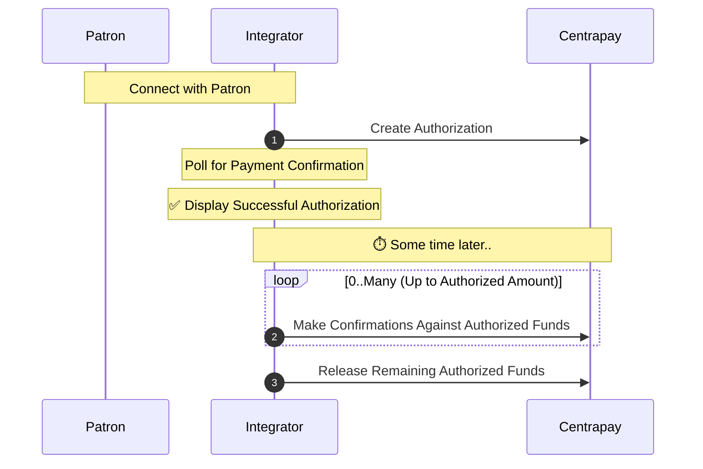

Centrapay’s Pre Auth extension allows a patron to authorize payment up to a limit when the actual payment amount is not yet known.

## Restrictions

Pre Auth payments are not supported in all cases.

1. Not all asset types support Pre Auth - Payment options for [Asset Types](/api/asset-types) that do not support Pre Auth will be excluded when a [Payment Request](/api/payment-requests/) is created with the `preAuth` flag.
2. Pre Auth is incompatible with Multi-Asset payments - Only one asset type can be authorized for a Pre Auth.

## Pre Auth Flow

Pre Auth payments go through an orthogonal payment flow compared to Centrapay’s standard payment flow.

> The example below shows the integrator polling for the Payment Request, this is not needed for eCommerce as the integrator will be informed when the authorization has completed.

> See also: [Requesting Payment](/guides/requesting-payment).

1. The Integrator places a hold on funds by creating an Authorization.
2. The Integrator draws down on authorized funds by making Confirmations against the authorization when the purchase is ready to be fulfilled.
3. The Integrator releases any remaining funds that have not been confirmed back to the Patron.

### Authorize

An authorization is created when the [Payment Request is created](/api/payment-requests#create-a-payment-request) with the `preAuth` flag while [Requesting Payment](/guides/requesting-payment).

Once the authorization is successful, the Payment Request `preAuthStatus` is set to `authorized`.

### Confirm

Merchants can draw down on authorized funds by making one or more [confirmations](/api/payment-requests#confirm-pre-auth-payment-request) against an authorized amount. Confirmations must be made with an `idempotencyKey` in order to prevent merchants from drawing down on authorized funds twice.

Confirmations against authorized funds have limits:

- Authorizations must be followed up with a confirmation - otherwise, the authorization will expire and the funds will be returned to the asset holder.

    The `preAuthExpiry` may be adjusted to match pre-determined expiry rules set by the asset provider.

- Multiple confirmations can be performed against an authorization but the total value cannot exceed the original authorized value.

### Release

Authorized funds that have not been confirmed can optionally be [released](/api/payment-requests#release-pre-auth-funds) so that the asset holder is granted access to their remaining funds without needing to wait for the authorization to expire.
Once releasing any remaining authorized funds is successful, the Payment Request `preAuthStatus` is set to `released`.

>Authorizations automatically expire after 3 months. Any unreleased funds are subsequently released to the Patron.

### Refund

[Refunds](/guides/initiating-refunds) can be made against authorizations, confirmations, released authorizations and expired authorizations.

Refunds made against confirmations must include the `confirmationIdempotencyKey` field that is the same as the `idempotencyKey` used for original confirmation.

### Void

[Voiding a Payment Request](/api/payment-requests#void-a-payment-request) will cancel a Payment Request and trigger any refunds necessary. This operation is useful if the Integrator needs to back out of a transaction due to a network error for example. Voiding can only be used up to 24 hours after the Payment Request was created.
